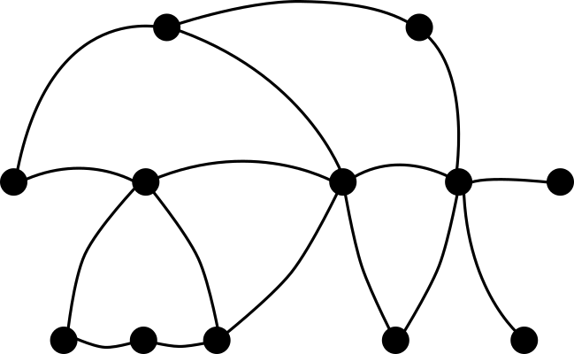

\newcommand{\indep}{\perp \!\! \perp}
\newcommand{\indic}{1\!\!1}

```{r setup, include=FALSE}
knitr::opts_chunk$set(echo = TRUE)
```

We want to use the graphical model tools for extreme value theory to build a new way of clustering variable, as done for the graphical models for Gaussian vector [@touwClusterpathGaussianGraphical2024].

Let $V = \{1, \dots, d\}$.

# Introduction


For a multivariate random variable, it can be useful to know the dependence structure between the components. Particularly, we can summarise the conditional dependence structure with a graph $\mathcal G = (V,E)$ with $E \subset V \times V$ as below : 

<center>
{width=60%}
</center>

$~$

For classical conditional independence (in term of density factorisation), we call such variables graphical models.

**Construction of a graph**

Let $X$ a graphical model according to the graph  $\mathcal G = (V,E)$.

Then, by definition, there is the relation : 

$$
(i,j) \in E \Longleftrightarrow X_i \indep X_j ~|~X_{V\setminus\{i,j\}}
$$
It is the pairwise Markov property.

The graphoid structure of such a relation gives us the equivalence between parwise Markov property and the global Markov property : 

$$
A \perp_\mathcal G B ~|~C \Longrightarrow  X_A \indep X_B ~|~X_C
$$
where $\perp_\mathcal G$ is the separation relation between sets of nodes.


We would like to cluster the variable using the graphical model structure to be able to get an interpretation of the clusters and then reduce the dimension of the graph. In that sense, we would have the nodes as the clusters and the edge thanks to the global Markov properties relationship existing between these. 


However for general graph, it is not easy. Indeed even with three clusters, we can have this type of situation : 

<center>

</center>
$~$

and each time, we have the fact that : 
$$
X_A \indep X_B ~|~X_C
$$

So we want to : 

- get a **unique** decomposition using the graphical model structure.

- link this decomposition to **a way of clustering the variables.**

# Husler-Reiss graphical model

In this section, we will present quickly the Husler-Reiss distribution in the MGPD case, and a present the notion of conditional independence in this context, together with the characterisation of this conditional independence for Husler-Reiss graphical models. 

## Definition of a Husler-Reiss model

Now we consider a MGPD random vector $Y$ indexed by $V$.

The Husler-Reiss model is a MGPD parameterized by a symmetric conditionally negative definite matrix $\Gamma$ with $\text{diag}(\Gamma) = 0$. 

One knows that every MGPD is defined by an exponent measure $\Lambda$ giving a correspondence between MGEV and MGPD (see [@rootzenMultivariateGeneralizedPareto2006]). For the case of the Husler-Reiss distribution, the exponent measure is absolutely continuous with respect to the Lebesgue measure on the cone $\mathcal E = \mathbb R_+^d \setminus \{0\}$ and its derivative is given by [@engelkeEstimationHueslerReissDistributions2012] for any $k \in V$ : 


$$
\lambda(y) = y_k^{-2} \prod_{i\neq k} y_i^{-1}\phi(\tilde y_{\setminus k}; \Sigma^{(k)}), \quad y \in \mathcal E
$$
where $\phi(.,\Sigma)$ is the density function of a gaussian vector centered with covariance matrix  $\Sigma$, $\tilde y_{\setminus k} = (\log(y_i/y_k) + \Gamma_{ik}/2)_{i \in V}$ and : 

$$
\Sigma^{(k)}_{ij} = \frac{1}{2} (\Gamma_{ik} + \Gamma_{kj}-\Gamma_{ij}) \quad \text{for } i,j \neq k
$$

which is obviously definite positive.

## Characterisation of a HRGM

For extreme value theory, the notion of conditional independence is very complicated to defined. First, for max-stable distribution with continuous positive density, the notion of conditional independence is equivalent to the global independence of the variables (Papastathopoulos reference). Moreover, for the MGPD case, the random vector is not even defined in a product space which make impossible the use of conidtional independence.

Hopefully, [@engelkeGraphicalModelsExtremes2020] build a new notion of conditional independence, adapted to MGPD distribution and then permit us to make graphical model with this type of distribution. 

Let $A, B$ and $C$ a parition of $V$. Then for MGPD random vector $Y$ indexed by $V$, we say that $Y_A$ is conditionally independent of $Y_B$ given $Y_C$ if :

$$
Y_A^k \indep Y^k_B~ |~ Y^k_C, \quad \quad \forall k  \in V.
$$ 
where $Y^k$ is defined as the vector $Y$ conditionally to the event $\{Y_k >1\}$.

We note then $Y_A \indep_e Y_B ~| ~Y_C$.

Moreover, in the same article, they give a first characterisation of the extremal conditional independence for Husler-Reiss models : 

**Proposition.** For a Husler-Reiss graphical model (HRGM) $Y$ with variogram $\Gamma$, then for all $i,j \in V$ and $k \in V$ we have : 

$$
Y_i \perp_e Y_j ~|~ Y_{\setminus \{i,j\}} \Leftrightarrow 
\begin{cases} 
\Theta^{(k)}_{ij} = 0, &\text{if } i,j \neq k, \\ 
\sum \Theta^{(k)}_{lj} = 0, &\text{if } i =k, j \neq k,\\
\sum \Theta^{(k)}_{il} = 0,&\text{if } i\neq k, j=k
\end{cases}
$$

where $\Theta^{(k)}$ is the precision matrix of $\Sigma^{(k)}$ (i.e $\Theta^{(k)} = (\Sigma^{(k)})^{-1}$). 

In [@hentschelStatisticalInferenceHuslerReiss2023], they build an extended precision matrix $\Theta$ which summarize all the information we need for the conditional independence relationship for the extremal graphical models, in that sense : 

$$
Y_i \indep_e Y_j ~|~ Y_{V\setminus\{i,j\}} \quad \Longleftrightarrow \quad \Theta_{ij} = 0.
$$

This matrix can be obtain by using some applications (which are bijections) that garanties a form of unicity of the spectral representation. 

Therefore, let's consider the following applications :
$$
\sigma: \Gamma \mapsto \Pi_d(-\frac 1 2 \Gamma) \Pi_d, \quad \quad \quad \theta: \Gamma \mapsto \sigma(\Gamma)^+
$$
where the matrix $A^+$ is the general inverse of $A$, and $\Pi_d$ the orthogonal projection matrix in the space $<\indic>^\perp$.

They show in [@hentschelStatisticalInferenceHuslerReiss2023] that the above applications are homeomorphisms between the set of the strictly conditionally negative definite variogram matrix $\mathcal D_d$ ad the set of symmetric positive semi-definite matrix with kernel equal to $<\indic>$, denoted by $\mathcal P_d^1$. More they show that : 

$$
\sigma^{-1}(\Sigma) = \gamma(\Sigma), \quad \quad \theta^{-1}(\Theta) = \gamma(\Theta^+),
$$

where $\gamma(\Sigma)=\indic \text{diag}(\Sigma)^T + \text{diag}(\Sigma) \indic^T - 2 \Sigma$.

# Clusterpath for GGM

In this section, we will present the matrix structure we will use for the Husler-Reiss graphical model. More, we will present an algorithm to estimate this graphical structure.

## Gaussian Graphical Model

In [@touwClusterpathGaussianGraphical2024], they build a graphical model that we can use for clustering, in the case of Gaussian graphical model (GGM). 

For the GGM, there exists an easy characterisation of the conditional independence which is similar to HRGM for the extreme. For a Gaussian graphical model $X$ with covariance matrix $\tilde \Sigma$, we have : 

$$
X_i \indep_e X_j ~|~ X_{V\setminus\{i,j\}} \quad \Longleftrightarrow \quad \tilde\Theta_{ij} = 0,
$$

where $\tilde \Theta = \tilde \Sigma^{-1}$, the precision matrix.

Let assume that the variable $X$ can be grouped in $K$ clusters $\{C_1, \dots, C_K\}$ with $p_k = |C_k|$.

The goal was to encouraging clustering of the graph by forcing the precision matrix to have a $K$ blocks structure as follows : 

$$
\tilde \Theta = 
\begin{pmatrix} 
(a_{11} - r_{11})I_{p_1} & 0 & \dots & 0 \\
0 & (a_{22} - r_{22})I_{p_2} & \dots & 0 \\
\vdots & \vdots & \ddots & \vdots \\
0 & 0 & \dots &(a_{KK} - r_{KK})I_{p_K}
\end{pmatrix} + 
\begin{pmatrix} 
r_{11} \indic \indic^t & r_{12} \indic \indic^t & \dots & r_{1K} \indic \indic^t \\
r_{21} \indic \indic^t& r_{22} \indic \indic^t & \dots & r_{2K} \indic \indic^t \\
\vdots & \vdots & \ddots & \vdots \\
r_{K1} \indic \indic^t & r_{K2} \indic \indic^t & \dots &r_{KK} \indic \indic^t
\end{pmatrix},
$$
where $A$ is a $K\times K$ diagonal matrix, $R$ a $K\times K$ symmetric matrix, $I_p$ the $p \times p$identity matrix.

We can then get this type of "graph factorisation" which is unique due to precision matrix structure : 


<center>
{width=70%}
</center>

$~$

Thus, with this factorisation, we build three clusters with an interpretation of conditional independence between them. 

For the estimation of the precision matrix, they use the following likelihood : 

$$
L(\Theta) = - \log(|\Theta|) + tr(\Sigma\Theta),
$$

where $\log(|.|)$ is the logarithm of the determinant and $tr(.)$ the trace.

To get the maximum likelihood, they use a convex penalty to get the unknown block structure of the precision matrix. Thus, we got this optimisation program : 

$$
\hat \Theta = \arg \min_\Theta \Big[- \log(|\Theta|) + tr(\overline \Sigma\Theta) + \lambda\mathcal P(\Theta)\Big], \quad \quad s.t. \Theta^t = \Theta, ~~\Theta >0
$$

where $\overline \Sigma$ is an estimation of the covariance matrix $\tilde \Sigma$.


From now, as we have for $i,j \in C_k$ that $\theta_{.i} = \theta_{.j}$, we will note $\theta_{C_k}$ the vector of the precision matrix of the cluster $C_k$.


## Clusterpath algorithm

In order to find the groups in precision matrix $\tilde \Theta$, we will use the clusterpath algorithm from [@hockingClusterpathAlgorithmClustering]. 

For these convex optimisation programs, we impose to the penalty function to be of the form : 
$$
\mathcal P(\Theta) = \sum_{i<j} w_{ij} D(\theta_{.i}, \theta_{.j}),
$$
where $w_{ij}$ are some positive weights, and $D$ a distance in $\mathbb R^d$.

**The distance $D$**

We can use a lot of distance : 

- with the $l^p$ norm for $p\in [1, \infty]$.

- in particular $l^1$, $l^2$ and $l^\infty$.

- in [@touwClusterpathGaussianGraphical2024] they use another distance defined as : 
$$
D(\theta_{.i}, \theta_{.j}) = \sqrt{(\theta_{ii} - \theta{jj})^2 + \sum_{k\neq i,j} (\theta_{ik} - \theta_{jk})^2}
$$
which "can be interpreted as a group lasso penalty". 


**Choice of $w_{ij}$**

The choice of $w_{ij}$ is also free, even if they present one which seems better (or nearer from the data) using : 
$$
w_{ij} = \exp(-a ||\theta_{.i} - \theta_{.j}||^2)
$$

where $||.||$ is the $l^2$ norm.

**Clusterpath algorithm** 

The algorithm is a gradient descent algorithm, adding conditions to detect clusters and fuse variables. 

\newpage

| Algorithm 1 : Clusterpath   |
| :--------------- |
|**Input:** initial guess $\Theta$, initial estimation $\overline\Sigma$, initial clusters, weight $w_{ij}$, regularisation $\lambda$ |
|G <- `gradient(.)`  |
|**while** $||G|| > \varepsilon$ **do** |
| $\quad$ $\Theta$ <- `step_grad(.)`
| $\quad$ $\Theta$, clusters <- `detect_cluster(.)`
| $\quad$ G <- `gradient(.)`  |
|**end while** |
|**return** $\Theta$, clusters|

The `gradient` function depends on all the parameters, `step_grad(.)` is just the step part of a gradient descent algorithm : we update the estimation by :

$$
\hat\Theta_{k+1} \leftarrow \hat\Theta_k - h \times \nabla L(\Theta)
$$

For the `detect_cluster(.)`, the clusters merged if the distance between two groups $C_1$ and $C_2$ is under a small threshold. Then, the coefficient of the new cluster $C$ is computed by the weighted mean of the two other one : 

$$
\theta_C = \frac{|C_1| \theta_{C_1}+|C_2| \theta_{C_2}}{|C_1| +|C_2|}.
$$

We can also try to fuse clusters if the cost function decreases if merging.

# Clusterpath adaptated for HRGM

Now we want to adapt the previous method to the Husler-Reiss graphical models.

## Maximum likelihood for graphical model

For the estimation of the precision matrix for HRGM, [@hentschelStatisticalInferenceHuslerReiss2023] shows that :  
$$
L(\Theta) =  \log(|\Theta|_+) + \frac12 tr(\overline \Gamma\Theta),
$$

where $\overline \Gamma$ is an estimation of the variogram matrix $\Gamma$ and $|.|_+$ the generalised determinant. 

For the next, we will first use the $l^2$ norm penalty and we will try to minimize : 

$$
L_\mathcal P(\Theta, \lambda) = L(\Theta) + \lambda \mathcal P(\Theta)
$$

with $\lambda >0$ and $\Theta \in \mathcal P_d^1$.

## Adaptation of the expression

As $\Theta \in \mathcal P_d^1$, there are supplementary conditions on the matrix : the rows must sum to one !

It follows that : 
$$
a_{kk} = r_{kk} - \sum_{j=1}^K p_j r_{kj}, \quad \quad \forall k \in\{1, \dots, K\}
$$

More, we can rewrite the matrix $\Theta$ as follow [@touwClusterpathGaussianGraphical2024] :

$$
\Theta = 
\begin{pmatrix} 
(a_{11} - r_{11})I_{p_1} & 0 & \dots & 0 \\
0 & (a_{22} - r_{22})I_{p_2} & \dots & 0 \\
\vdots & \vdots & \ddots & \vdots \\
0 & 0 & \dots &(a_{KK} - r_{KK})I_{p_K}
\end{pmatrix} + 
U R U^t,
$$

where $U$ is a $d\times K$ matrix such that $u_{ij} = 1$ if $i\in C_j$ and 0 otherwise. 

Then we can deduce the computation of the trace of $\overline \Gamma \Theta$ : 

$$
tr(\overline \Gamma \Theta)= tr(\overline \Gamma URU^t) + \sum_{k=1}^K(a_{kk} - r_{kk})tr(\overline \Gamma_k) \Big(= tr(\overline \Gamma URU^t) -\sum_{l=1}^K p_l \sum_{k=1}^Kr_{kl}tr(\overline \Gamma_k)\Big)
$$

with $\overline \Gamma_k$ the $p_k \times p_k$ matrix computed from $\overline \Gamma$ with the indices in $C_k$.

## Computation of the derivative


## Simulation study


### References


