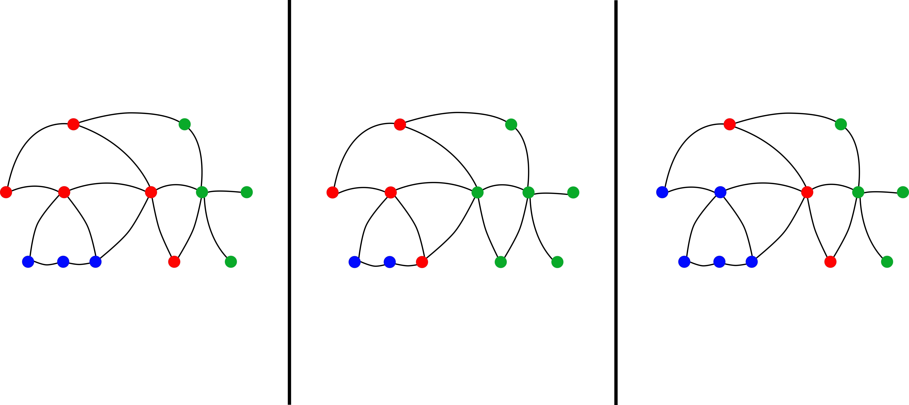

\newcommand{\indep}{\perp \!\! \perp}
\newcommand{\indic}{1\!\!1}

```{r setup, include=FALSE, message=FALSE, warning = FALSE}
knitr::opts_chunk$set(echo = TRUE)

pacman::p_load(graphicalExtremes,
               targets)

source("./src/functions.R")
```

\newpage

We want to use the graphical model tools for extreme value theory to build a new way of clustering variable, as done for the graphical models for Gaussian vector [@touwClusterpathGaussianGraphical2024].

Let $V = \{1, \dots, d\}$.

# Introduction


For a multivariate random variable, it can be useful to know the dependence structure between the components. Particularly, we can summarise the conditional dependence structure with a graph $\mathcal G = (V,E)$ with $E \subset V \times V$ as below : 

<center>
{width=60%}
</center>

$~$

For classical conditional independence (in term of density factorisation), we call such variables graphical models.

**Construction of a graph**

Let $X$ a graphical model according to the graph  $\mathcal G = (V,E)$.

Then, by definition, there is the relation : 

$$
(i,j) \in E \Longleftrightarrow X_i \indep X_j ~|~X_{V\setminus\{i,j\}}
$$
It is the pairwise Markov property.

The graphoid structure of such a relation gives us the equivalence between parwise Markov property and the global Markov property : 

$$
A \perp_\mathcal G B ~|~C \Longrightarrow  X_A \indep X_B ~|~X_C
$$
where $\perp_\mathcal G$ is the separation relation between sets of nodes.


We would like to cluster the variable using the graphical model structure to be able to get an interpretation of the clusters and then reduce the dimension of the graph. In that sense, we would have the nodes as the clusters and the edge thanks to the global Markov properties relationship existing between these. 


However for general graph, it is not easy. Indeed even with three clusters, we can have this type of situation : 

<center>
{width=80%}
</center>
$~$

and each time, we have the fact that : 
$$
X_A \indep X_B ~|~X_C
$$

So we want to : 

- get a **unique** decomposition using the graphical model structure.

- link this decomposition to **a way of clustering the variables.**

# Husler-Reiss graphical model

In this section, we will present quickly the Husler-Reiss distribution in the MGPD case, and a present the notion of conditional independence in this context, together with the characterisation of this conditional independence for Husler-Reiss graphical models. 

## Definition of a Husler-Reiss model

Now we consider a MGPD random vector $Y$ indexed by $V$.

The Husler-Reiss model is a MGPD parameterized by a symmetric conditionally negative definite matrix $\Gamma$ with $\text{diag}(\Gamma) = 0$. 

One knows that every MGPD is defined by an exponent measure $\Lambda$ giving a correspondence between MGEV and MGPD (see [@rootzenMultivariateGeneralizedPareto2006]). For the case of the Husler-Reiss distribution, the exponent measure is absolutely continuous with respect to the Lebesgue measure on the cone $\mathcal E = \mathbb R_+^d \setminus \{0\}$ and its derivative is given by [@engelkeEstimationHueslerReissDistributions2012] for any $k \in V$ : 


$$
\lambda(y) = y_k^{-2} \prod_{i\neq k} y_i^{-1}\phi(\tilde y_{\setminus k}; \Sigma^{(k)}), \quad y \in \mathcal E
$$
where $\phi(.,\Sigma)$ is the density function of a gaussian vector centered with covariance matrix  $\Sigma$, $\tilde y_{\setminus k} = (\log(y_i/y_k) + \Gamma_{ik}/2)_{i \in V}$ and : 

$$
\Sigma^{(k)}_{ij} = \frac{1}{2} (\Gamma_{ik} + \Gamma_{kj}-\Gamma_{ij}) \quad \text{for } i,j \neq k
$$

which is obviously definite positive.

## Characterisation of a HRGM

For extreme value theory, the notion of conditional independence is very complicated to defined. First, for max-stable distribution with continuous positive density, the notion of conditional independence is equivalent to the global independence of the variables (Papastathopoulos reference). Moreover, for the MGPD case, the random vector is not even defined in a product space which make impossible the use of conidtional independence.

Hopefully, [@engelkeGraphicalModelsExtremes2020] build a new notion of conditional independence, adapted to MGPD distribution and then permit us to make graphical model with this type of distribution. 

Let $A, B$ and $C$ a parition of $V$. Then for MGPD random vector $Y$ indexed by $V$, we say that $Y_A$ is conditionally independent of $Y_B$ given $Y_C$ if :

$$
Y_A^k \indep Y^k_B~ |~ Y^k_C, \quad \quad \forall k  \in V.
$$ 
where $Y^k$ is defined as the vector $Y$ conditionally to the event $\{Y_k >1\}$.

We note then $Y_A \indep_e Y_B ~| ~Y_C$.

Moreover, in the same article, they give a first characterisation of the extremal conditional independence for Husler-Reiss models : 

**Proposition.** For a Husler-Reiss graphical model (HRGM) $Y$ with variogram $\Gamma$, then for all $i,j \in V$ and $k \in V$ we have : 

$$
Y_i \perp_e Y_j ~|~ Y_{\setminus \{i,j\}} \Leftrightarrow 
\begin{cases} 
\Theta^{(k)}_{ij} = 0, &\text{if } i,j \neq k, \\ 
\sum \Theta^{(k)}_{lj} = 0, &\text{if } i =k, j \neq k,\\
\sum \Theta^{(k)}_{il} = 0,&\text{if } i\neq k, j=k
\end{cases}
$$

where $\Theta^{(k)}$ is the precision matrix of $\Sigma^{(k)}$ (i.e $\Theta^{(k)} = (\Sigma^{(k)})^{-1}$). 

In [@hentschelStatisticalInferenceHuslerReiss2023], they build an extended precision matrix $\Theta$ which summarize all the information we need for the conditional independence relationship for the extremal graphical models, in that sense : 

$$
Y_i \indep_e Y_j ~|~ Y_{V\setminus\{i,j\}} \quad \Longleftrightarrow \quad \Theta_{ij} = 0.
$$

This matrix can be obtain by using some applications (which are bijections) that garanties a form of unicity of the spectral representation. 

Therefore, let's consider the following applications :
$$
\sigma: \Gamma \mapsto \Pi_d(-\frac 1 2 \Gamma) \Pi_d, \quad \quad \quad \theta: \Gamma \mapsto \sigma(\Gamma)^+
$$
where the matrix $A^+$ is the general inverse of $A$, and $\Pi_d$ the orthogonal projection matrix in the space $<\indic>^\perp$.

They show in [@hentschelStatisticalInferenceHuslerReiss2023] that the above applications are homeomorphisms between the set of the strictly conditionally negative definite variogram matrix $\mathcal D_d$ ad the set of symmetric positive semi-definite matrix with kernel equal to $<\indic>$, denoted by $\mathcal P_d^1$. More they show that : 

$$
\sigma^{-1}(\Sigma) = \gamma(\Sigma), \quad \quad \theta^{-1}(\Theta) = \gamma(\Theta^+),
$$

where $\gamma(\Sigma)=\indic \text{diag}(\Sigma)^T + \text{diag}(\Sigma) \indic^T - 2 \Sigma$.

# Clusterpath for GGM

In this section, we will present the matrix structure we will use for the Husler-Reiss graphical model. More, we will present an algorithm to estimate this graphical structure.

## Gaussian Graphical Model

In [@touwClusterpathGaussianGraphical2024], they build a graphical model that we can use for clustering, in the case of Gaussian graphical model (GGM). 

For the GGM, there exists an easy characterisation of the conditional independence which is similar to HRGM for the extreme. For a Gaussian graphical model $X$ with covariance matrix $\tilde \Sigma$, we have : 

$$
X_i \indep_e X_j ~|~ X_{V\setminus\{i,j\}} \quad \Longleftrightarrow \quad \tilde\Theta_{ij} = 0,
$$

where $\tilde \Theta = \tilde \Sigma^{-1}$, the precision matrix.

Let assume that the variable $X$ can be grouped in $K$ clusters $\{C_1, \dots, C_K\}$ with $p_k = |C_k|$.

The goal was to encouraging clustering of the graph by forcing the precision matrix to have a $K$ blocks structure as follows : 

$$
\tilde \Theta = 
\begin{pmatrix} 
(a_{1} - r_{11})I_{p_1} & 0 & \dots & 0 \\
0 & (a_{2} - r_{22})I_{p_2} & \dots & 0 \\
\vdots & \vdots & \ddots & \vdots \\
0 & 0 & \dots &(a_{K} - r_{KK})I_{p_K}
\end{pmatrix} + 
\begin{pmatrix} 
r_{11} \indic \indic^t & r_{12} \indic \indic^t & \dots & r_{1K} \indic \indic^t \\
r_{21} \indic \indic^t& r_{22} \indic \indic^t & \dots & r_{2K} \indic \indic^t \\
\vdots & \vdots & \ddots & \vdots \\
r_{K1} \indic \indic^t & r_{K2} \indic \indic^t & \dots &r_{KK} \indic \indic^t
\end{pmatrix},
$$
where $A$ is a $K\times K$ diagonal matrix, $R$ a $K\times K$ symmetric matrix called the reduced matrix, $I_p$ the $p \times p$identity matrix.

We can then get this type of "graph factorisation" which is unique due to precision matrix structure : 

<center>
{width=70%}
</center>

$~$

Thus, with this factorisation, we build three clusters with an interpretation of conditional independence between them. 

For the estimation of the precision matrix, they use the following likelihood : 

$$
L(\Theta) = - \log(|\Theta|) + \text{tr}(\Sigma\Theta),
$$

where $\log(|\cdot|)$ is the logarithm of the determinant and $\text{tr}(\cdot)$ the trace.

To get the maximum likelihood, they use a convex penalty to get the unknown block structure of the precision matrix. Thus, we got this optimisation program : 

$$
\hat \Theta = \arg \min_\Theta \Big[- \log(|\Theta|) + \text{tr}(\overline \Sigma\Theta) + \lambda\mathcal P(\Theta)\Big], \quad \quad s.t. \Theta^t = \Theta, ~~\Theta >0
$$

where $\overline \Sigma$ is an estimation of the covariance matrix $\tilde \Sigma$.


From now, as we have for $i,j \in C_k$ that $\theta_{\cdot i} = \theta_{\cdot j}$, we will note $\theta_{C_k}$ the vector of the precision matrix of the cluster $C_k$.


## Clusterpath algorithm

In order to find the groups in precision matrix $\tilde \Theta$, we will use the clusterpath algorithm from [@hockingClusterpathAlgorithmClustering]. 

For these convex optimisation programs, we impose to the penalty function to be of the form : 
$$
\mathcal P(\Theta) = \sum_{i<j} w_{ij} D(\theta_{\cdot i}, \theta_{\cdot j}),
$$
where $w_{ij}$ are some positive weights, and $D$ a distance in $\mathbb R^d$.

**The distance $D$**

We can use a lot of distance : 

- with the $l^p$ norm for $p\in [1, \infty]$.

- in particular $l^1$, $l^2$ and $l^\infty$.

- in [@touwClusterpathGaussianGraphical2024] they use another distance defined as : 
$$
D(\theta_{.i}, \theta_{.j}) = \sqrt{(\theta_{ii} - \theta_{jj})^2 + \sum_{k\neq i,j} (\theta_{ik} - \theta_{jk})^2}
$$
which "can be interpreted as a group lasso penalty". 


**Choice of $w_{ij}$**

The choice of $w_{ij}$ is also free, even if they present one which seems better (or nearer from the data) using : 
$$
w_{ij} = \exp(-\zeta ||\theta_{\cdot i} - \theta_{\cdot j}||^2)
$$

where $||.||$ is the $l^2$ norm.

**Clusterpath algorithm** 

The algorithm is a gradient descent algorithm, adding conditions to detect clusters and fuse variables. 

| Algorithm 1 : Clusterpath   |
| :--------------- |
|**Input:** initial guess $\Theta$, initial estimation $\overline\Sigma$, initial clusters, weight $w_{ij}$, regularisation $\lambda$ |
|G <- `gradient(.)`  |
|**while** $||G|| > \varepsilon$ **do** |
| $\quad$ $\Theta$ <- `step_grad(.)`
| $\quad$ $\Theta$, clusters <- `detect_cluster(.)`
| $\quad$ G <- `gradient(.)`  |
|**end while** |
|**return** $\Theta$, clusters|

The `gradient` function depends on all the parameters, `step_grad(.)` is just the step part of a gradient descent algorithm. We update the estimation by :

$$
\hat\Theta_{k+1} \leftarrow \hat\Theta_k - h \times \nabla L(\Theta)
$$

For the `detect_cluster(.)`, the clusters merged if the distance between two groups $C_1$ and $C_2$ is under a small threshold. Then, the coefficient of the new cluster $C$ is computed by the weighted mean of the two other one : 

$$
\theta_C = \frac{|C_1| \theta_{C_1}+|C_2| \theta_{C_2}}{|C_1| +|C_2|}.
$$

We can also try to fuse clusters if the cost function decreases if merging.

# Clusterpath adaptated for HRGM

Now we want to adapt the previous method to the Husler-Reiss graphical models.

## Maximum likelihood for graphical model

For the estimation of the precision matrix for HRGM, [@hentschelStatisticalInferenceHuslerReiss2023] shows that find the $\Theta$ is equivalent to minimise :  
$$
L(\Theta) =  -\log(|\Theta|_+) - \frac12 tr(\overline \Gamma\Theta),
$$

where $\overline \Gamma$ is an estimation of the variogram matrix $\Gamma$ and $|\cdot|_+$ the generalised determinant. 

For the next, we will first use the $l^2$ norm penalty and we will try to minimize : 

$$
L_\mathcal P(\Theta, \lambda) = L(\Theta) + \lambda \mathcal P(\Theta)
$$

with $\lambda >0$ and $\Theta \in \mathcal P_d^1$.

## Adaptation of the expression

As $\Theta \in \mathcal P_d^1$, there are supplementary conditions on the matrix : the rows must sum to one !

It follows that : 
$$
a_{k} = r_{kk} - \sum_{j=1}^K p_j r_{kj}, \quad \quad \forall k \in\{1, \dots, K\}
$$

More, we can rewrite the matrix $\Theta$ as follow [@touwClusterpathGaussianGraphical2024] :

$$
\Theta = 
\begin{pmatrix} 
(a_{1} - r_{11})I_{p_1} & 0 & \dots & 0 \\
0 & (a_{2} - r_{22})I_{p_2} & \dots & 0 \\
\vdots & \vdots & \ddots & \vdots \\
0 & 0 & \dots &(a_{K} - r_{KK})I_{p_K}
\end{pmatrix} + 
U R U^t,
$$

where $U$ is a $d\times K$ matrix such that $u_{ij} = 1$ if $i\in C_j$ and $0$ otherwise. 

Then we can deduce the computation of the trace of $\overline \Gamma \Theta$ : 

$$
tr(\overline \Gamma \Theta)= \text{tr}(\overline \Gamma URU^t) + \sum_{k=1}^K(a_{k} - r_{kk})\text{tr}(\overline \Gamma_{C_k})
$$

with $\overline \Gamma_{C_k}$ the $p_k \times p_k$ matrix computed from $\overline \Gamma$ with the indices in $C_k$. But as $\overline \Gamma$ get only zero in its diagonal, we finally obtain : 

$$
tr(\overline \Gamma \Theta) = \text{tr}(\overline \Gamma URU^t)
$$

**Adaptation of the distance**

Let's take square $l^2$ norm penalty for $\mathcal P$. 

For $i, j$ in the same cluster $C_k$ we have : 

$$
||\theta_{\cdot i} - \theta_{\cdot j}||^2 = 2(a_{k} - r_{kk})^2
$$

Here, we wish that for two variables in the same cluster, this distance is equal to zero. 

The distance $D$ from [@touwClusterpathGaussianGraphical2024] is built for this reason. But in our case we can upgrade the distance : indeed, our matrix $\Theta$ have an additionally constraint that rows sum to $0$. Thus, we can remove the $(\theta_{ii} - \theta_{jj})^2$ term as the latter is obviously equal to zero if we are in the same cluster. 

Therefore, we will consider the following squared distance for the next : 

$$
D^2(\theta_{.i}, \theta_{.j}) =  \sum_{t\neq i,j} (\theta_{it} - \theta_{jt})^2
$$


Now, it is time to write the penalty formula with the $R$ matrix. We have :

- for $i,j$ in the same cluster $D^2(\theta_{.i}, \theta_{.j}) =0$ (it is the goal of this distance).

- for $i, j$ in respectively the clusters $C_k$ and $C_l$ we have : 

\begin{align*}
D^2(\theta_{.i}, \theta_{.j}) =& \sum_{t\neq i,j} (\theta_{it} - \theta_{jt})^2 \\ 
 = &\sum_{q \neq k,l} p_m (r_{kq}-r_{lq})^2 +(p_k-1) (r_{kk}-r_{lk})^2+(p_l-1) (r_{ll}-r_{lk})^2\\ 
 = & \tilde D^2(r_{\cdot k}, r_{\cdot l}).
\end{align*}


Then, by grouping all the terms in $\mathcal P$, we get : 

$$
\mathcal P(R) = \sum_{l>k} W_{kl} \tilde D^2(r_{\cdot k}, r_{\cdot l})
$$

with $W_{lk} = \sum_{i \in C_k}\sum_{j \in C_l}w_{ij}$.

Our likelihood can now be expressed as a function of the $R$-matrix. 


## Computation of the derivative

We can see that the penalized negative log-likelihood can be decomposed as a sum of three element : 

$$
L_\mathcal P(R, \lambda) = L_{log}(R) + L_{trace}(R) + \lambda L_{pen}(R)
$$

So we just need to compute separately all the derivative for each coefficient (in the upper triangular part, by symmetry). 

### Gradient of $L_{log}(R)$

Let's denote $E = \{(i,j) \in [\!|1, d |\! ]^2, i < j\}$ and $F = \{(k,l) \in [\!|1, K |\! ]^2, k\le l \}$ and we consider $\mathbb R^E$ and $\mathbb R^F$ the set of real-valued vector indexed by $E$ anf $F$.

One can show that there exists a function $f : \mathbb R^F \rightarrow \mathbb R^E$ such that :

$$
f(R) = U(\Theta) 
$$

where $U$ is the application defined in [@hentschelStatisticalInferenceHuslerReiss2023] which maps a matrix to a vector in $\mathbb R^E$ containing the entries in the upper triangular part of the matrix.

Then we can defined also the function $g :\mathbb R^E \rightarrow \mathbb R$ as : 
$$
g(U(\Theta)) = - \log(|\Theta|_+)
$$
which is well defined by symmetry of $\Theta$.

Thus we can see our sub-loglikelihood as : 
$$
L_{log}(R) = g \circ f(R)
$$

And then use the chain rule formula to get the partial derivative for $n \in F$ : 

$$
\frac{\partial L_{log}(R)}{\partial r_n} = \sum_{m \in E} \frac{\partial g}{\partial \theta_{m}}(f(R)) \times \frac{\partial f_m}{\partial r_n}(R)
$$

In the appendix of [@hentschelStatisticalInferenceHuslerReiss2023], they show that : 

$$
\frac{\partial g(U(\Theta))}{\partial \theta_m} =  \gamma(\Theta^+)_m, \quad \quad \text{for } m \in E
$$

Now we just have to compute the derivative of $f$. Let $m = (i,j) \in E$.
We can stress first that : 

$$
f_m(R) =r_{kl},  \quad \text{if } i\in C_k, ~ j \in C_l,~ \text{or } i\in C_l, ~ j \in C_k,~
$$

Then we can deduce the expression below : 

$$
\frac{\partial f}{\partial r_{kl}} =
\begin{cases} 
1  &\text{if } i \in C_k, ~j \in C_l,\text{ or } i \in C_l,~ j \in C_k, \\ 
0 & \text{otherwise} \end{cases}
$$

We can now associate these expressions to deduce for $k < l$ that : 

\begin{align*}
\frac{\partial L_{log}(R)}{\partial r_{kl}} &= \sum_{i<j} \gamma(\Theta^+)_{ij}\Big[ \indic_{i\in C_k}\indic_{j\in C_l}+\indic_{i\in C_l}\indic_{j\in C_k}\Big] \\
& = \sum_{i \in C_k}\sum_{j \in C_l}\gamma(\Theta^+)_{ij} \\
& = u_k^t\gamma(\Theta^+)u_l ,
\end{align*}

with $u_k$ the k-th column of the matrix of clusters $U$ and because $\gamma(\Theta^+)_{ii} = 0$. 

Moreover if $k=l$, we get : 

\begin{align*}
\frac{\partial L_{log}(R)}{\partial r_{kk}} &= \sum_{\underset{i<j}{i,j \in C_k}}\gamma(\Theta^+)_{ij} \\
&=  \frac 12 u_k^t\gamma(\Theta^+)u_k
\end{align*}

that ends the calculation.

**Warning.** When $p_k = 1$, we have $\frac{\partial L_{log}(R)}{\partial r_{kk}} =0$.

### Gradient of $L_{trace}(R)$

We recall that : 

$$
L_{trace}(R) = -\frac 1 2\text{tr}(\overline \Gamma URU^t)
$$

As we have for all symmetric matrix $A$ : 
$$
\frac{\partial tr(AB)}{\partial b_{ij}} = \begin{cases} 2 a_{ij} & \text{if } i \neq j, \\ a_{ii} & \text{otherwise.} \end{cases}
$$

Then we can deduce that for $(k,l) \in F$ : 
$$
\frac{\partial L_{trace}(R)}{\partial r_{kl}} =\begin{cases} -(U^t\overline \Gamma U)_{kl} & \text{if } k=l, \\  -\frac 1 2(U^t\overline \Gamma U)_{kk} & \text{otherwise.}\end{cases}
$$

**Warning.** Like the previous section, when $p_k = 1$, we have $\frac{\partial L_{trace}(R)}{\partial r_{kk}} =0$.

### Gradient of $L_{pen}(R)$


We recall that : 

$$
L_{pen}(R) = \sum_{l'>k'} W_{k'l'} \tilde D^2(r_{\cdot k'}, r_{\cdot l'})
$$

So we just need to compute the derivative of $\tilde D^2$ for each coefficient $r_{kl}$. 

Let $(k,l) \in F$.

Thus, for $k<l$, we have : 

$$
\frac{\partial D^2(r_{\cdot k'}, r_{\cdot l'})}{\partial r_{kl}} =
\begin{cases} 
2p_k(r_{kl} -r_{kk'}) & \text{if } k \neq k', l = l'\\ 
2p_l(r_{kl} -r_{ll'}) & \text{if } k = k', l \neq l'\\ 
2(p_k-1)(r_{kl} -r_{kk}) +2(p_l-1)(r_{kl} -r_{ll}) & \text{if } k = k', l = l'\\ 
0 & \text{otherwise.}
\end{cases}
$$

and for $k'<l'$ : 

$$
\frac{\partial D^2(r_{\cdot k'}, r_{\cdot l'})}{\partial r_{kk}} =
\begin{cases} 
2(p_k-1)(r_{kk} -r_{kl'}) & \text{if } k = k' \\ 
2(p_k-1)(r_{kk} -r_{k'k}) & \text{if } k = l'\\ 
0 & \text{otherwise.}
\end{cases}
$$

We can deduce the derivatives : 

$$
\nabla L_{pen}(R) = \sum_{k'<l'} W_{k'l'}\nabla \tilde D^2_{k'l'}(R)
$$

where $\tilde D^2_{k'l'}(R) = D^2(r_{\cdot k'}, r_{\cdot l'})$.


## Choice of a step for descent

In the gradient descent algorithm, we compute : 

$$
R^{(t+1)} \leftarrow R^{(t)} - h \nabla_R L(R), \quad \text{with } h>0
$$ 

where $h$ is called the step size.

However, in that case, we need to verify that after the step, $f(R^{(t+1)})$ is still a symmetric positive matrix. 

### Research of relationship between $R$ and $f(R) = \Theta$

In this section, we want to find condition on $R$ to make the $\Theta$ matrix positive. 

First, let's define the $K \times K$ alternative matrix of clusters :
$$
\tilde R = RP - T
$$ 
where $P = \text{diag}((p_k)_{k =1,\dots, K})$ and $T = \text{diag}((Rp)_{k=1, \dots, K})$.

**Proposition.** Let $R$ and $\Theta = f(R)$. Assume that : 

- $\forall k \in \{1,\dots, K\}, a_k - r_{kk} \ge 0$.

- the alternative matrix of clusters $\tilde R$ is positive. 

Then $\Theta$ is positive. 

**Proof.** A characterization of the positiveness of a matrix is that all its eigen values are positive. We want to get the expression of the latters with the coefficient of $R$, so we need to find the roots of the characteristic polynomial.

\begin{align*}
P_\Theta(X) = &\det(\Theta - X I_d) \\
= & \begin{vmatrix}
A_1 - XI_{p_1} & r_{12} \indic \indic^t& \cdots & \cdots & r_{1K} \indic \indic^t\\
r_{21} \indic \indic^t&A_2 - XI_{p_2} & \ddots&  &  \vdots \\
\vdots &  \ddots & \ddots& \ddots &\vdots \\
\vdots & & \ddots & A_{K-1}- XI_{p_{K-1}}&  r_{KK-1} \indic \indic^t \\
r_{K1} \indic \indic^t & \cdots & \cdots &r_{KK-1} \indic \indic^t  & A_K - XI_{p_K}
\end{vmatrix}
\end{align*}

with $A_k = \begin{pmatrix} a_k & r_{kk} & \cdots& r_{kk} \\ r_{kk} & a_k & \ddots& \vdots \\ \vdots & \ddots& \ddots & r_{kk} \\ r_{kk} & \cdots & r_{kk} & a_{kk}\end{pmatrix}$.

First, we can focus our calculation on the $p_1$ first lines. If we subtract the $p_1 - 1$ first lines by the $p_1-th$, we obtain : 

 
\begin{align*}
&P_\Theta(X)  =  \\ 
 & \begin{vmatrix}
a_1- r_{11}-X \quad \quad\quad 0  \quad\quad \quad\cdots  \quad\quad\quad  0 \quad \quad \quad \quad -(a_1- r_{11}-X) & 0 & & \cdots & 0\\
~~~0 \quad\quad\quad\quad\quad \ddots \quad\quad ~\ddots \quad~~~\quad \vdots \quad\quad\quad\quad\quad\quad\quad\quad \vdots  \quad & \vdots & & &  \vdots \\
\quad\quad\quad\vdots ~~~~~~~ \quad\quad\ddots \quad\quad\quad\ddots\quad\quad\quad  ~ 0 \quad\quad \quad \quad \quad \quad \quad \quad  \vdots \quad \quad\quad & \vdots & & & \vdots \\ 
\quad\quad\quad 0 \quad\quad\quad\quad\cdots\quad\quad \quad 0  \quad \quad  a_1 - r_{11} -X  ~~   \quad -(a_1- r_{11}-X) & 0 & & \cdots & 0 \\
r_{11} \quad\quad\quad \quad ~ \quad\quad\cdots ~\quad\quad \quad\quad\quad\quad r_{11} ~~ \quad\quad a_1 - X & r_{12} \indic ^t & & \cdots & r_{1K} \indic^t \\
r_{21} \indic \indic^t&A_2 - XI_{p_2} & \ddots&  &  \vdots \\
\vdots &  \ddots & \ddots& \ddots &\vdots \\
\vdots & & \ddots & A_{K-1}- XI_{p_{K-1}}&  r_{KK-1} \indic \indic^t \\
r_{K1} \indic \indic^t & \cdots & \cdots &r_{KK-1} \indic \indic^t  & A_K - XI_{p_K}
\end{vmatrix} \\ 
= & (a_1 - r_{11} - X)^{p_1-1}\begin{vmatrix}
~1 ~~\quad 0  \quad ~~  \cdots  ~~~ \quad 0 \quad -1 ~~~& 0 & & \cdots & 0\\
~0  ~ ~~~\ddots \quad   \ddots \quad~~\vdots \quad \quad\vdots  \quad  & \vdots & & &  \vdots \\
\vdots\quad \ddots \quad ~\ddots \quad  0  \quad \quad   \vdots ~~ & \vdots & & & \vdots \\ 
0 \quad \cdots \quad 0 \quad\quad~~ 1 \quad -1 & 0 & & \cdots & 0 \\
\quad r_{11}  \quad  \quad\cdots  \quad \quad r_{11} \quad  a_1 - X & r_{12} \indic ^t & & \cdots & r_{1K} \indic^t \\
r_{21} \indic \indic^t&A_2 - XI_{p_2} & \ddots&  &  \vdots \\
\vdots &  \ddots & \ddots& \ddots &\vdots \\
\vdots & & \ddots & A_{K-1}- XI_{p_{K-1}}&  r_{KK-1} \indic \indic^t \\
r_{K1} \indic \indic^t & \cdots & \cdots &r_{KK-1} \indic \indic^t  & A_K - XI_{p_K}
\end{vmatrix}
\end{align*}

Thus we can reproduce these operations in each $p_k$ blocks. Finally, by summing the one column with the minus one, we get :

$$
P_\Theta(X) =\prod_{k = 1} ^K (a_k - r_{kk} - X)^{p_k-1} \det(\tilde R - X I_K)
$$

Obviously, if the condition of the proposition are true, then the root of this polynomial are all positive. 

<div style="text-align:right;">\hfill $\square$</div>


### Gridline search for the optimal step size

With the previous proposition, we can have an upper bound for the step size $h$. Indeed, let's note $\delta_{kl}$ the gradient along $r_{kl}$. Then, if the previous step $R^{(t)}$  verifies the conditions of the proposition, the optimal step size $h^*$ should verify : 

\begin{align*}
&\forall k\in \{1,\dots, K\},~ a^{(t+1)}_k - r^{(t+1)}_{kk} \ge 0  \\ 
\Longleftrightarrow ~&\forall k\in \{1,\dots, K\}, ~\sum_{l=1}^K p_lr^{(t+1)}_{lk} \le 0 \\
\Longleftrightarrow ~&\forall k\in \{1,\dots, K\},~ \sum_{l=1}^K p_l(r^{(t)}_{lk} - h^*\delta_{lk}) \le 0 \\
\Longleftrightarrow ~&\forall k\in \{1,\dots, K\},~ \sum_{l=1}^K p_lr^{(t)}_{lk}  \le h^* \sum_{l=1}^K p_l \delta_{lk}
\end{align*}

Therefore, we obtain the cases : 

- if $\sum_{l=1}^K p_l \delta_{lk} > 0$ then $h^* \ge \sum_{l=1}^K p_lr^{(t)}_{lk} /\sum_{l=1}^K p_l \delta_{lk}$ which is a negative number as $R^{(t)}$ follows the relations. So, as $h^* > 0$, there is no constraint in this case.

- if $\sum_{l=1}^K p_l \delta_{lk} < 0$ then $h^* \le \sum_{l=1}^K p_lr^{(t)}_{lk} /\sum_{l=1}^K p_l \delta_{lk}$.

- if $\sum_{l=1}^K p_l \delta_{lk} = 0$, no constraint as well except non negative.

Thus, we will set our grid line in the segment $(0, h_{max}]$ where :

$$
h_{max} = \min_{k=1, \dots , K}\Big |\frac{\sum_{l=1}^K p_lr^{(t)}_{lk}}{\sum_{l=1}^K p_l \delta_{lk}}\Big |
$$

and we will choose the value $h^*$ which minimizes the objective function provided that the alternative matrix of clusters $\tilde R^{(t+1)}$ is positive. 


## Fusing approximation

Let suppose that we can write $\Theta = f(R)$ and let's note $\varepsilon_f$ the fusing threshold between two clusters. Assume that the two clusters $C_k$ and $C_l$ are mergeable that is to say : 

$$
\tilde D^2(r_{r \cdot}, r_{l \cdot}) \le \varepsilon_f
$$

In that case, we note the fused cluster $C = C_k \cup C_l$ and the new matrix $R^*$ which is indexed by $(\{1, \dots, K \}\setminus \{k,l\}) \cup C$ is defined as : 

$$
r^*_{pm} = \begin{cases} 
\frac{p_k r_{km} + p_l r_{lm}}{p_k + p_l} & \text{if } m \neq p = C\\
\frac{p_k r_{kp} + p_l r_{lp}}{p_k + p_l} & \text{if } p \neq m = C\\
r_{kl} &\text{if } m = p = C \\
r_{pm} &\text{otherwise} \\
\end{cases}
$$

**Proposition** In the setting as above, we have : 

- for small enough $\varepsilon_f$, $f(R^*)$ is valid.

- for fixed $\lambda$ and weights $w$, we have : 

$$
|L_{\mathcal P}(R, \lambda) - L_{\mathcal P}(R^*, \lambda)| \underset{\varepsilon_f \rightarrow 0}{\longrightarrow} 0 
$$


**Proof.** For the first point, let's consider the metric space $\mathcal S_d^1$, the space of symmetric matrix with kernel equal to $\textbf{span}(\{\indic\})$, equipped with the topology of $(\mathcal M_d(\mathbb R), ||\cdot ||_F)$, where $||\cdot ||_F$ is the Frobenius norm. 

Now, we focus on the function : 

\begin{align*}
g : \mathcal S_d^1 & \longrightarrow \mathbb R^{d-1} \\
\Theta &\longmapsto \lambda(\Theta) = (\lambda_i(\Theta))_{i=1, \dots,d-1}
\end{align*}


We know that $g$ is continuous then $g^{-1}((\mathbb R_+^*)^{d-1})$ is an open set of $\mathcal S_d^1$. Therefore, it exists $\varepsilon^* >0$ such that : 

$$
B(\Theta, \varepsilon^*)\cap \mathcal S_d^1 \subset g^{-1}((\mathbb R_+^*)^{d-1})
$$

Thus, we know that if $\varepsilon_f$ is small, then $\Theta^* = f(R^*) \in \mathcal S_d^1$ and $\Theta$ are closed for the Frobenius norm, so we finally have $\Theta^* \in \mathcal P_d^1$.

For the second point, we need to show first that : 

$$
\tilde D^2(r_{r \cdot}, r_{l \cdot}) \le \varepsilon_f^2 \Longrightarrow ||f(R) - f(R^*)||_F \le \sqrt{(2 + ||p||^2) p_C}\varepsilon_f
$$


First, we have : 

$$
(\Theta - \Theta^*)_{ij} = \begin{cases} a_{k'} - a^*_{k'} & \text{if } i=j \in C_{k'} \\
r_{k'k'} - r^*_{k'k'} & \text{if } i, j \in C_{k'}, i \neq j \\
r_{k'l'} - r^*_{k'l'} & \text{if } i \in C_{k'}, j \in C_{l'} \end{cases}
$$

We choose to keep the same indices for $R$ and $R^*$ and $r^*_{kl'} = r^*_{Cl'}$ and the same for all the other cases (it does not change the results).

**Case $k'\notin \{k,l\}$**

We have : 

\begin{align*}
a^*_{k'} &=
r^*_{k'k'} - \sum_{l'\neq k,l} p_{l'}
r^*_{k'l'} - 
p^*_Cr_{Ck'} \\
&= r_{k'k'} - \sum_{l'\neq k,l} p_{l'} r_{k'l'} - (p_k + p_l) \frac{p_k r_{k'k} + p_l r_{k'l}}{p_k + p_l} \\
&= r_{k'k'} - \sum_{l' = 1}^K p_{l'} r_{k'l'} \\
&= a_{k'}
\end{align*}

and therfore $(\Theta - \Theta^*)_{ii} = 0$ for $i\in C_{k'}$. 

**Case $k'\in \{k,l\}$**

Let's focus ourselves in the case when $k'=k$ (the other is exactly the same). We have : 

$$
a^*_{k} =r^*_{CC} - \sum_{l'\neq k,l} p_{l'}r^*_{Cl'} - p^*_Cr_{CC} =  r_{kl} - \sum_{l'\neq k,l} p_{l'}r^*_{Cl'} - (p_k + p_l)r_{kl}\\
$$

Thus : 

$$
(a_{k} - a^*_{k})^2 = \big[\sum_{l'\neq k,l} p_{l'}(r_{kl'} - r^*_{Cl'}) + r_{kk} - r_{kl} - p_k r_{kk} - p_l r_{kl} - (p_k + p_l)r_{kl}\big]^2\\
= \big[ \sum_{l'\neq k,l} p_{l'}(r_{kl'} - r^*_{Cl'}) + (p_k -1 )(r_{kk} - r_{kl}) \big]^2
$$

By using Lipschtizian property of linear application in finite dimension we finaly get : 

$$
(a_{k} - a^*_{k})^2 \le ||p||^2 \varepsilon_f^2
$$
We get the same inequality if $i\in C_l$.


Now $i \neq j$.

**Case $i,j \in C_{k'}$**

First, we can notice that this case can happen for a $k'$ only if $p_{k'} >1$. We have : 

$$
(\Theta - \Theta^*)_{ij} = \begin{cases} 
r_{kk} - r_{kl} & \text{if } k' = k,\\ 
r_{ll} - r_{kl} &   \text{if } k' = l,\\
0 & \text{otherwise.}
\end{cases}
$$


**Case $i\in C_{k'},j \in C_{l'}$**

$$
(\Theta - \Theta^*)_{ij} = \begin{cases} 
r_{kl'} - r^*_{kl'} & \text{if } k' = k, l' \notin \{k,l\}\\ 
r_{ll'} - r^*_{ll'} &   \text{if } k' = l,l' \notin \{k,l\}\\
0 & \text{otherwise.}
\end{cases}
$$

(Sure, the role of $k'$ and $l'$ is symmetric due to the symmetry of the matrices).

Now we need to see the structure of the difference between the mamtrices. We can summarize this with the following figure : \newpage

<center>

</center>
$~$

The black stars in the upper figure is zero. Thus we have : 

- by combining red stars and green stars that : 

$$
\sum_{j\neq i}(\Theta_{ij} - \Theta^*_{ij})^2 = \sum_{l'\neq k,l} p_{l'}(r_{kl'} - r^*_{Cl'})^2 + (p_k -1 )(r_{kk} - r_{kl})^2 \le \varepsilon_f^2
$$
if $i \in C_k$.

- by combining red stars and green stars again that : 

$$
\sum_{j\neq i}(\Theta_{ij} - \Theta^*_{ij})^2 = \sum_{l'\neq k,l} p_{l'}(r_{ll'} - r^*_{Cl'})^2 + (p_l -1)(r_{ll} - r_{kl})^2 \le \varepsilon_f^2
$$
if $i \in C_l$.

Thus, we get :

- in black, the zeros.

- in orange, $p_C (=p_k + p_l)$ majorations by $||p||^2 \varepsilon_f^2$.

- for the red zone (without orange), we have $2p_k$ majorations by $\varepsilon_f^2$.

- for the blue zone (without orange), we have $2p_l$ majorations by $\varepsilon_f^2$.

Therefore, we finally obtain : 

\begin{align*}
|| \Theta -\Theta^*||_F^2 &\le 2p_C \varepsilon_f^2 + p_C||p||^2 \varepsilon_f^2 \\
& \le \big[2 + ||p||^2\big] p_C\varepsilon_f^2 \\
\end{align*}

*Note that we will obtain the same expression if $p_{\max} = 1$ because there will be zero green majoration.*

Now, we know that in $[a, \infty)$ the logarithm is $\frac 1a$-Lispschizian, so we can deduce by the lemma on generalised determinant that:

$$
|\log(|f(R)|_+) - \log(|f(R)|_+)| \le \frac{L_m}a ||f(R) - f(R^*)||_F
$$

Also, we can find that : 

\begin{align*}
| \frac12\text{tr} (\bar \Gamma \Theta) - \frac12\text{tr} (\bar \Gamma \Theta^*)| &=
| \frac12\sum_{i,j} \bar \gamma_{ij}(\theta_{ij} -  \theta^*_{ij}) | \\
&\le  \frac12\sum_{i,j} |\bar \gamma_{ij}||\theta_{ij} - \theta^*_{ij}|\\ &\le \sum_{i<j} |\bar
\gamma_{ij}| ||\Theta - \Theta^*||_F
\end{align*}

That means : 

$$
| \frac12\text{tr} (\bar \Gamma f(R)) - \frac12\text{tr} (\bar \Gamma f(R^*))| \le k_{\bar \Gamma}||f(R) - f(R^*)||_F
$$

where $k_{\bar \Gamma} = \sum_{i<j} |\bar \gamma_{ij}|$.

And finally, as we have : 

$$
|D^2(\theta_{.i}, \theta_{.j}) - D^2(\theta^*_{.i}, \theta^*_{.j})| \le D^2( \theta_{.i}, \theta^*_{.i}) + D^2( \theta_{.j}, \theta^*_{.j})
$$

And that : 

$$
D^2( \theta_{.i}, \theta^*_{.i}) \le ||\Theta - \Theta^*||_F^2
$$

We can deduce that : 

$$
| \mathcal P(\Theta) - \mathcal P (\tilde \Theta^*) | \le k_W||\Theta - \Theta^*||_F^2
$$
where $k_W = 2 \sum_{i<j}w_{ij}$

Thus, we can fuse all the inequality to get : 


\begin{align*}
|L_\mathcal P (R, \lambda) - L_\mathcal P (R^*, \lambda) | &\le (\frac{L_m}a + k_{\bar \Gamma} + \lambda k_W||f(R) - f(R^*)||_F)||f(R) - f(R^*)||_F \\
& \le \sqrt{(2 + ||p||^2) p_C}(\frac{L_m}a + k_{\bar \Gamma} + \lambda \sqrt{(2 + ||p||^2) p_C}\varepsilon_f k_W)\varepsilon_f
\end{align*}


And so $|L_\mathcal P (R, \lambda) - L_\mathcal P (R^*, \lambda) | \rightarrow 0$ when $\varepsilon_f \rightarrow 0$.

<div style="text-align:right;">\hfill $\square$</div>

*I think we can optimize the constant.*

## Condition on the one cluster fusing

One problem can appear during the optimization procedure : the non fusion of the clusters in one element when $\lambda \rightarrow \infty$.

Indeed, let's take $W$ the weigth matrix. From this matrix, we can build a graph $\mathcal G$ on $V$ were the edges are defined : 

$$
(i,j) \in E \Longleftrightarrow w_{ij} \neq 0
$$

Now if we assume that this graph is not connected (and there exists $M>1$ connected components, denoted by $E_m$), then we can rewrite the objective function as : 

$$
L_{\mathcal P}(R, \lambda) = L_{\log}(R) + L_{trace}(R) + \lambda \sum_{m=1}^M\Big(\sum_{i,j\in E_m} w_{ij} d^2(\theta_{i\cdot},\theta_{j\cdot})\Big)
$$

In that equation, we see that we will not have garantee that the clusters $E_m$ fuse between them because for large $\lambda$ we will normally get the $E_m$ clusters and then the penalty will not appear when we get the $M$ clusters.

## Continuity of the solution

First let's recall the problem and see what we can say. We would like to get a solution :

$$
Q_\lambda : \arg\min_\Theta \{ L(\Theta) + \lambda\mathcal{P}(\Theta) \} , \quad \quad \Theta \in \mathcal P^1_d.
$$

First, [@hentschelStatisticalInferenceHuslerReiss2023] show that the function $L$ is convex on $\mathcal P^1_d$. As $\mathcal P$ is only a linear combination (with positive coefficient) of distances, the penalised likelihood is also convex on $\mathcal P^1_d$. 

Moreover, we have also :

**Proposition.** The set $\mathcal P^1_d$ is convex.

**Proof.** By definition a matrix $A$ belongs to $\mathcal P^1_d$ if it is symmetric and : 
$$
x^t A x \ge 0, \quad \quad \text{with equality iff } x \in < \indic >.
$$

Let be $A$ and $B$ two matrices in $\mathcal P_d^1$. Let $\mu \in (0,1)$ then we have : 

- $\mu A + (1-\mu)B$ is symmetric.

- let $x \in \mathbb R^d$, then : 
$$
x^t(\mu A + (1-\mu)B) x = \mu \underbrace{(x^t A x)}_{\ge 0} + (1-\mu) \underbrace{x^t B x}_{\ge 0} \ge 0 
$$

More $x^t(\mu A + (1-\mu)B) x = 0$ if and only if $x^t A x = 0$ and $x^t B x = 0$ (because all is positive). As $A$ and $B$ are in $\mathcal P_d^1$ theses two equality occur if and only if $x \in < \indic >$. Thus, $\mu A + (1-\mu)B \in \mathcal P_d^1$. 

<div style="text-align:right;">\hfill $\square$</div>

Thus the problem $Q_\lambda$ is a convex problem and admits a unique minimizer.

Now, let's study in details a specific model. 

**Proposition.** Let $\lambda > 0$ and the problem $Q_\lambda$. Assume that it exists $\lambda^*>0$ such that the solution of the corresponding problem verifies $\mathcal P(\Theta)=0$. Then for all $\lambda \ge \lambda^*$, the solution of $Q_\lambda$ is the same as $Q_{\lambda^*}$.

**Proof.** First let's note that for $\lambda' \le \lambda$ with $\Theta$ and $\Theta'$ the respective solutions of  $Q_\lambda$ and  $Q_{\lambda'}$, and we have : 

$$
 \mathcal P(\Theta') \ge \mathcal P(\Theta)
$$

Now if we take $\lambda' = \lambda^*$, we have : 

$$
\mathcal P(\Theta) = 0
$$

And thus for all $\lambda^* \le \lambda$ the problem $Q_\lambda$ is equivalent to : 

$$
\arg \min_{\Theta, \mathcal P(\Theta) = 0} L(\Theta)
$$

But as the set $\{\Theta \in \mathcal P^d_1, \mathcal P(\Theta) = 0\}$ is convex, the solution is unique again and then does not change from $\lambda^*$.

<div style="text-align:right;">\hfill $\square$</div>

From now, we will suppose that the assumptions of the last proposition are verified. Then, we can define a the following function : 

\begin{align*}
\Theta : [0, \lambda^*] &\rightarrow \mathcal P_d^1 \\
\lambda &\mapsto \Theta(\lambda)
\end{align*}

where $\Theta(\lambda)$ is the solution of the problem $Q_\lambda$ (well defined by the convexity of the problem).

We would like to show that it is a path between two elements in $\mathcal P_d^1$ : the first one is the classical estimator of the precision matrix $\Theta(0) = \hat \Theta$ and the second one is a matrix such that we will note $\Theta^* = \Theta(\lambda^*)$ for convenience. Thus, the main goal here is to prove the continuity of the application of solution.

**Lemma.** Let be $\{\Theta(\lambda)\}_{\lambda \in [0, \lambda^*]}$, the collection of all the solution of the problem $Q_\lambda$ for all $\lambda \ge 0$. The set $\{||\Theta(\lambda)||_F~|~\lambda \in [0, \lambda^*]\}$ is bounded.

**Proof.** First, let's stress that the application $L$ is coercive on $\mathcal P_d^1$, that means that : 
$$
\lim_{||\Theta||_F \rightarrow +\infty} L(\Theta) = +\infty
$$

Then, as we have for all $\lambda \le \lambda^*$ : 

$$
L(\Theta(\lambda)) + \lambda \mathcal P(\Theta(\lambda)) \le L(\Theta^*) + \lambda^* \mathcal P(\Theta^*)
$$

Therefore, as the image of the collection by the application is bounded, we must have that the set $\{||\Theta(\lambda)||_F~|~\lambda \in [0, \lambda^*]\}$ is bounded otherwise it will bring a contradiction with the coercivity of the appplication $L$.

<div style="text-align:right;">\hfill $\square$</div>

**Proposition.** The application $\lambda \mapsto \Theta(\lambda)$ is a path between $\hat \Theta$ and $\Theta^*$. 

**Proof.** Let be $(\lambda_n)_{n \in \mathbb N}$ a sequence of $[0, \lambda^*]$  which converges to a limit $\lambda'$. Then, we can build a new sequence $(\Theta_n)_{n \in \mathbb N}$ in $\mathcal P_d^1$, induced by the latter, and defined by : 

$$
\Theta_n = \Theta(\lambda_n)
$$

We would like to show that the sequence $(\Theta_n)_{n \in \mathbb N}$ converges to the matrix $\Theta'= \Theta(\lambda')$.

First, from the lemma, we have that the sequence $(\Theta_n)_{n \in \mathbb N}$ is bounded. Moreover, let's take a convergent subsequence $(\Theta_{\phi(n)})_{n \in \mathbb N}$ and let's note its limit $\tilde \Theta$. By definition, we have that for all $\Theta \in \mathcal P_d^1$ : 

$$
L(\Theta_{\phi(n)}) + \lambda_{\phi(n)} \mathcal P(\Theta_{\phi(n)}) \le L(\Theta) + \lambda_{\phi(n)} \mathcal P(\Theta) 
$$

Therefore, if we take the limit : 
$$
L(\tilde \Theta) + \lambda' \mathcal P(\tilde \Theta) \le L(\Theta) + \lambda' \mathcal P(\Theta) 
$$

But, this means that $\tilde \Theta$ is a solution of the problem $Q_{\lambda'}$ and by unicity we have $\tilde \Theta = \Theta'$. 

So, as the sequence $(\Theta_n)_{n \in \mathbb N}$ is bounded and admits only one subsequential limit, the sequence converge to this limit which is $\Theta(\lambda')$. So the application $\lambda \mapsto \Theta(\lambda)$ is continuous.

<div style="text-align:right;">\hfill $\square$</div>

Now, we would like to show the crucial point of our algorithm. Let's note : 

$$
d_{ij}(\Theta) = D( \theta_{.i}, \theta_{.j}),
$$

for all $i, j \in V$.


# Concentration and convergence results

## On the weights

First, we want ot recall a results from [@engelkeLearningExtremalGraphical2024] about the empirical variogram :

**Theorem.** Let be $X_1,\dots, X_n$ independent copies of a random vector $X$ where its attraction domain is an Husler-reiss distribution. Let be the empirical variogram $\hat \Gamma$ as defined in [@engelkeLearningExtremalGraphical2024]. Let $\alpha \in (0,1)$ arbitrary. Then, it exists $C$, $c$ and $M$ depending on $\alpha$ such that we have : 

$$
\mathbb P \big(||\hat \Gamma - \Gamma ||_\infty > f(n) \big) < g(n),
$$

where $f(n) = C \Big( n^{\beta(\alpha - 1)}(\alpha -1)^2 \log(n)^2 + \frac{1}{\log(n)^4}+ \frac{1}{n^{\frac \alpha 2}}\Big)$ and $g(n) = M d^3 \times \exp(- \frac{cn^\alpha}{\log(n)^8})$.

*We can notice that for both functions, we have :* 
$$
f(n) \underset{n \rightarrow \infty}{\longrightarrow} 0,
$$

*and*

$$
g(n) \underset{n \rightarrow \infty}{\longrightarrow} 0.
$$

Moreover, we can write an alternative version to this concentration inequality. 

**Corollary.** In the same situation as the last we have for $\varepsilon < C \frac{e^{-1}}{2}$ : 

$$
\mathbb P(||\hat \Gamma_n - \Gamma ||_\infty > \varepsilon) \le Md^3 e^{-c\left[ \sqrt[4]{n} (\frac{\varepsilon}{C} - \frac{e^{-1}}{2})^2-1\right]}
$$

**Proof.** First, the map $x \mapsto Ax^K \log(x)^2$ is (upper) bounded and the maximum is reached for $x =  e^{-2K}$. In our cases, we have that for $\alpha = \frac 12$ : 
$$
C ( n^{\beta (\alpha-1)}(\alpha-1)^2\log(n)^2 + \frac{1+\lambda}{\sqrt{n^\alpha}}) \le C \left( \frac 14 e^{-\frac{\beta^2}{2}} \beta^2 + \frac{1+\lambda}{\sqrt[4]{n}}\right)
$$

Finally, we just have to notice that $\frac 14 e^{-\frac{\beta^2}{2}} \beta^2 \le \frac{e^{-1}}{2}$ for any $\beta >0$ and $\varepsilon \le C \left(\frac{e^{-1}}{2} + \frac{1 + \sqrt[4]{n} / \log(n)^4}{\sqrt[4]{n}} \right) \le C \frac{e^{-1}}{2}$ to end the proof.

<div style="text-align:right;">\hfill $\square$</div>

With this formulation, one can notice that using Borel-Cantelli lemma, we obtain the convergence almost surely of $\hat \Gamma_n$ to $\Gamma$ since $e^{-\sqrt[4]{n}} = o(\frac{1}{n^2})$.

We will use this inequality to show the following statement :

**Proposition.** Let be $Y$ a HRGM with the cluster graph structure. Let be $\hat \Gamma$ the empirical variogram verifying the above concentration inequality. Let be $(\zeta_n)_{n\in \mathbb N}$, a sequence which tends to infinity and such that : 

$$
\zeta_n = o_n((4(d-2)f(n)^2)^{-1}).
$$

Then we have : 

- if $i$ and $j$ are in the same cluster, then : 

$$
\mathbb P \big(w_{ij}^{(n)} < \exp(-4(d-2)\zeta_n f(n)^2)\big) \le 2(d-2)g(n)
$$

- for large enough $n$, if $i$ and $j$ are not in the same clusters, then : 

$$
\mathbb P\big(w_{ij}^{(n)} > \exp(-\zeta_n F_{ij}(n)^2)\big) \le 2g(n)
$$

**Proof.** We have to split the proof in two part : when $i$, $j$ are in the same cluster, and where they are not. 

**Case where $i$ and $j$ are in the same cluster.**

First, we can easily see that for $k \neq i,j$, we have that : 

$$
|\hat \Gamma_{ik} - \hat \Gamma_{jk}| \le |\hat \Gamma_{ik} - \Gamma_{ik}|+|\hat \Gamma_{ik} - \Gamma_{jk}|
$$

Thus, as we have a control on $||\hat \Gamma - \Gamma||_\infty$ by the theorem, we have the control on each coefficient individually, and we can deduce that : 

$$
\mathbb P \big(|\hat \Gamma_{ik} - \hat \Gamma_{jk}| > 2f(n) \big) \le 2g(n)
$$

As we have this inequality for all $k \neq i,j$, we have also : 

$$
\mathbb P \big(d_{ij}(\hat \Gamma) > 4(d-2)f(n)^2 \big) \le 2(d-2)g(n)
$$

Now, let's note $F(n) = 4(d-2)f(n)^2$ and $G(n) = 2(d-2)g(n)$. We can obtain the concentration inequality using the bijection $t \mapsto \exp(-\zeta t)$ : 

$$
\mathbb P \big(w_{ij}^{(n)} < \exp(-\zeta F(n)) \big) \le G(n)
$$

which show the first part of the proposition. 

**Case where $i$ and $j$ are not in the same cluster.**

First, we have : 

$$
| |\hat \Gamma_{ik} - \hat \Gamma_{jk}| - |\Gamma_{ik} -  \Gamma_{jk}| | \le |\hat \Gamma_{ik} - \Gamma_{ik}| + |\hat \Gamma_{jk} -  \Gamma_{jk}| 
$$

So, as $f(n) \underset{n \rightarrow \infty}{\longrightarrow} 0$, let's take from which $2f(n) < |\Gamma_{ik} -  \Gamma_{jk}|$. Now using the concentration inequality and the upper majoration, we get :

$$
\mathbb P \big(|\Gamma_{ik} -  \Gamma_{jk}| - 2f(n) > |\hat \Gamma_{ik} - \hat \Gamma_{jk}| \big) \le 2g(n)
$$

Let's note $F_{ij}(n) = \max_{k \neq i,j} \{ |\Gamma_{ik} -  \Gamma_{jk}| \} -2f(n)$, then we have : 

$$
\mathbb P \big(F_{ij}(n)^2 > d_{ij}(\hat \Gamma) \big) \le \mathbb P \big( \bigcap_{k\neq i, j}\{F_{ij}(n) > |\hat \Gamma_{ik} - \hat \Gamma_{jk}| \}\big)
$$

If we note $k^*$ the indice where the minimum is reached, we have : 

$$
\mathbb P \big(F_{ij}(n)^2 > d_{ij}(\hat \Gamma) \big) \le \mathbb P \big(F_{ij}(n) > |\hat \Gamma_{ik^*} - \hat \Gamma_{jk^*}| \big) \le 2g(n)
$$

Thus, by using again the bijection $t \mapsto \exp(-\zeta t)$, we obtain that : 

$$
\mathbb P\big(w_{ij}^{(n)} > \exp(-\zeta F_{ij}(n)^2)\big) \le 2g(n)
$$

which show the second inequality. 

**Choice of the sequence $\zeta_n$**

Now, we saw that we have these two results : 

$$
\mathbb P \big(w_{ij}^{(n)} < \exp(-\zeta F(n)) \big) < G(n),
$$

and :

$$
\mathbb P\big(w_{ij}^{(n)} > \exp(-\zeta F_{ij}(n)^2)\big) \le 2g(n).
$$

We have that $F(n)$ is equivalent to $\log(n)^{-4}$ when $n$ tends to infinity. Then, let's take a sequence $(\zeta_n)_{n \in \mathbb N^*}$ which is equivalent to $\log(n)^s$ with $0< s < 8$, for example $\zeta_n = \log(n)^3$. Then we have : 

$$
\zeta_n F(n) = o_n(1)
$$

that means $\zeta_n F(n) \underset{n \rightarrow \infty}{\longrightarrow} 0$.

Moreover, $\zeta_n \underset{n \rightarrow \infty}{\longrightarrow} +\infty$ and $F_{ij}(n) \underset{n \rightarrow \infty}{\longrightarrow} \max_{k \neq i,j} \{ |\Gamma_{ik} -  \Gamma_{jk}| \}>0$ and then : 

$$
F_{ij}(n)\zeta_n \underset{n \rightarrow \infty}{\sim} \log(n)^3 \max_{k \neq i,j} \{ |\Gamma_{ik} -  \Gamma_{jk}| \}
$$

and this conclude the proof.

<div style="text-align:right;">\hfill $\square$</div>

*We also see with these concentration inequalities that :* 
$$
\mathbb P(w_{ij}^{(n)} < 1) \underset{n \rightarrow \infty}{\longrightarrow} 0,
$$

*for $i$, $j$ in the same cluster and :*

$$
\mathbb P(w_{ij}^{(n)} > 0) \underset{n \rightarrow \infty}{\longrightarrow} 0,
$$

*otherwise.*

## Convergence of the extremum

Let's recall the previous results and the notation. We consider that the random vector $X$ belongs to the attraction domain of an $K$-clustered HRGM, where we will note $\{C_1, \dots, C_K\}$ the list of clusters and $\Gamma$ the variogram. 

Let be $X_1, \dots, X_n$, $n$ replications of the variable $X$. We consider the penalised likelihood of the precision matrix $\Theta^*$ of $\Gamma$ by : 

$$
L_{\mathcal P}^{(n)}(\Theta, \lambda) = \underbrace{-\log(|\Theta|_+) - \frac 12 \text{tr}(\hat \Gamma^{(n)}\Theta)}_{L^{(n)}(\Theta)} + \lambda \sum_{i<j} w_{ij}^{(n)} d^2_{ij}(\Theta)
$$

where $w_{ij}^{(n)} = \exp(-\zeta_n d^2_{ij}(\hat \Gamma^{(n)}))$ with $(\zeta_n)_{n \in \mathbb N^*}$ a sequence which is equivalent to $\log(n)^s$ with $0< s < 8$.

The last theorem tells us that : 
$$
w_{ij}^{(n)} \overset{\mathbb P}{\underset{n \rightarrow \infty}{\longrightarrow}} \begin{cases} 1 & \text{if } \exists k \in \{1, \dots K\}, i,j \in C_k  \\ 0 & \text{otherwise.} \end{cases}
$$

For a fixed $\lambda >0$, let's note $\Theta_n(\lambda)$ the solution of the optimization problem. The aim is to show that : 
$$
\Theta_n(\lambda) \underset{n \rightarrow \infty}{\longrightarrow} \Theta^*, \quad \quad \text{a.s.}
$$


**Proposition.** Let be $X_1, \dots, X_n$, $n$ replications of a $K$-CHRGM and $(\zeta_n)_{n \in \mathbb N^*}$ a sequence as introduced previously. Then, we have for all $\Theta \in \mathcal P^1_d$ : 
$$
L_{\mathcal P}^{(n)}(\Theta, \lambda)  \overset{\mathbb P}{\underset{n \rightarrow \infty}{\longrightarrow}} L(\Theta, \lambda)
$$
where $L(\Theta, \lambda) = -\log(|\Theta|_+) - \frac 12 \text{tr}(\Gamma\Theta) + \lambda \sum_{k=1}^K \sum_{i,j \in C_k}d^2_{ij}(\Theta)$.

**Proof.** Consequence of the continuity of $\Gamma \mapsto -\log(|\Theta|_+) - \frac 12 \text{tr}(\Gamma\Theta)$, the last theorems and the preservation of the convergence in probability by linear combination.

*We can also show that it converges almost surely, due to the consistency of the empirical variogram estimator.*

<div style="text-align:right;">\hfill $\square$</div>

Before showing the results, we want to show the following lemma :

**Lemma.** Let be $(X_n)_{n \in \mathbb N}$ and $(Y_n)_{n \in \mathbb N}$; two sequence of random variab le which respectively converge in probabilty to $X$ and $Y$. Then if $\mathbb P(X_n \ge Y_n) = 1$, we have that $X \ge Y$ almost surely.

**Proof.** Let's show this when $Y_n = 0$ for all $n$. So let be $X_n$ a sequence of positive random variable which converge in probability to a radom variable $X$. Let $\varepsilon>0$, we have that : 

$$
\mathbb P(X\le -\varepsilon) = \mathbb P(X - X_n \le -(\varepsilon+X_n)) 
 \le  \mathbb P(|X - X_n| \ge \varepsilon+X_n)
 \le  \mathbb P(|X - X_n| \ge \varepsilon)
$$

As we have $\mathbb P(|X - X_n| \ge \varepsilon) \underset{n \rightarrow \infty}{\longrightarrow} 0$, we can deduce that $\mathbb P(X\le -\varepsilon) =0$ for all $\varepsilon >0$ and so that : 
$$
\mathbb P(X < 0) = 0
$$

Thus, $X$ is positive almost surely. 

The case for an arbitrary $Y_n$ is obvious by using the sequence $Z_n = X_n - Y_n$.

<div style="text-align:right;">\hfill $\square$</div>

**Lemma.** Let be $X_1, \dots, X_n$, $n$ replications of a $K$-CHRGM and $(\zeta_n)_{n \in \mathbb N^*}$ a sequence which is equivalent to $\log(n)^s$ for $s \in (0,8)$. For all fixed $\lambda>0$, we denote by $\Theta_n(\lambda)$ the solution of the optimization problem for each $n$. Then $\{ \Theta_n(\lambda), n \in \mathbb N^*\}$ is bounded almost surely.


**Proof.** Let be $\Theta^*$ the minimizer of $L$. Let's now consider $r = ||\Theta^*||_F / 2$ and the closed ball $\bar B(\Theta^*, r)$. We have already shown that $L_{\mathcal P}^{(n)}$ and $L$ are lipschitzian functions then as $L_{\mathcal P}^{(n)}$ converges pointwisely to $L$ almost surely, we can deduce that it converges also uniformly on $\bar B(\Theta^*, r)$ alsmost surely. 

Thus, let's choose now $N$ such that for all $n\ge N$, we have : 

$$
||L_{\mathcal P}^{(n)} - L ||_\infty \le \varepsilon.
$$

To choose the right $\varepsilon>0$, let's considere the continuous application on the sphere of  $\bar B(\Theta^*, r)$ : 

$$
\Theta \longmapsto L(\Theta, \lambda) - L(\Theta^*, \lambda) 
$$

By continuity, the minimum, that we will not $m$ is reached, and is positive so we will choose $\varepsilon = \frac m 3$. Therefore, for all valid matrix in the sphere, we have that : 
$$
|L_{\mathcal P}^{(n)}(\Theta, \lambda) - L(\Theta, \lambda)| \le \varepsilon \le \frac{L(\Theta) - L(\Theta^*)}{3}
$$

and so that $L_{\mathcal P}^{(n)}(\Theta, \lambda) > L_{\mathcal P}^{(n)}(\Theta^*, \lambda)$. 

Now let's take $n \ge N$ and let's consider the solution $\Theta_n(\lambda)$. We all the previous construction, this ùatrix can't be out of the closed ball $\bar B(\Theta^*, r)$ because otherwise, by considering the segment $[\Theta^*, \Theta_n(\lambda)] \subset \mathcal P^1_d$, we only have to choose the matrix $\Theta_1$ such that $\Theta^* - \Theta_1|| = r$ and use the convexity to end on : 

$$
L_{\mathcal P}^{(n)}(\Theta, \lambda) \le \mu_1 L_{\mathcal P}^{(n)}(\Theta^*, \lambda) + (1-\mu_1) L_{\mathcal P}^{(n)}(\Theta_n(\lambda), \lambda) \le L_{\mathcal P}^{(n)}(\Theta^*, \lambda)
$$

which is a contradiction.

Thus for $n \ge N$, $\Theta_n(\lambda)$ belongs to the closed ball almost surely, and we can deduce the bound of the all sequence almost surely. 

<div style="text-align:right;">\hfill $\square$</div>

Now, we are able to show the consistency of our estimation and also, of our clusters.

**Theorem.** Let be $X_1, \dots, X_n$, $n$ replications of a $K$-CHRGM and $(\zeta_n)_{n \in \mathbb N^*}$ a sequence which is equivalent to $\log(n)^s$ for $s \in (0,8)$. For all fixed $\lambda>0$, we denote by $\Theta_n(\lambda)$ the solution of the optimization problem for each $n$. Then we have : 

$$
\Theta_n(\lambda) \underset{n \rightarrow \infty}{\longrightarrow} \Theta^*, \quad \quad a.s.
$$

**Proof.** Let $\lambda>0$ and put : 

$$
\Theta_n(\lambda) = \arg \min_{\Theta \in \mathcal P^1_d} L_{\mathcal P}^{(n)}(\Theta, \lambda)
$$

Thus, we have that the random variable $U_n =L_{\mathcal P}^{(n)}(\Theta_n(\lambda), \lambda)$ is bounded. Therefore, as the set of solution $\{ \Theta_n(\lambda), n \in \mathbb N^*\}$ is also bounded almost surely, we can extract a subsequence such that :

- $U_{\phi(n)}$ converges. 

- $\Theta_{\phi(n)}(\lambda)  \underset{n \rightarrow \infty}{\longrightarrow} \Theta_\infty(\lambda)$

We would like to show that $U_{\phi(n)} \overset{\mathbb P}{\underset{n \rightarrow \infty}{\longrightarrow}}  L(\Theta_\infty(\lambda), \lambda)$. 


Let $\varepsilon >0$. As we have : 

$$
|U_{\phi(n)} - L(\Theta_\infty(\lambda), \lambda) | \le |U_{\phi(n)} - L_{\mathcal P}^{(\phi(n))}(\Theta_\infty(\lambda), \lambda) | +|L_{\mathcal P}^{(\phi(n))}(\Theta_\infty(\lambda), \lambda) - L(\Theta_\infty(\lambda), \lambda) |
$$

We will first control the two rights terms. Let $\eta >0$, we will use the following facts :

- we know that $L_{\mathcal P}^{(n)}$ is continuous almost surely and then : 

$$
\forall n \in \mathbb N ^*, \exists \delta > 0, || \Theta_1 - \Theta_2 || < \delta \Rightarrow \mathbb P(|L_{\mathcal P}^{(n)}(\Theta_1)-L_{\mathcal P}^{(n)}(\Theta_2)| > \varepsilon / 2) < \eta / 2
$$

- the convergence probability given in the previous proposition gives us that for all $\Theta \in \mathcal P^1_d$ : 

$$
\exists N_1\in \mathbb N^*, \forall n \ge N_1 \mathbb P(|L_{\mathcal P}^{(n)}(\Theta) - L(\Theta, \lambda) | > \varepsilon / 2) < \eta /2
$$

- the almost surely convergence of the sequence $\Theta_{\phi(n)}(\lambda)$ : 
$$
\exists N_2 \in \mathbb N^*, \forall n \ge N_2, ||\Theta_{\phi(n)}(\lambda) - \Theta_\infty(\lambda) || < \delta 
$$

Let's take $N^* = \max\{N_1, N_2\}$. Then for $n \ge N^*$ we have : 

$$
\mathbb P(|U_{\phi(n)} - L(\Theta_\infty(\lambda), \lambda) | > \varepsilon) \le \mathbb P(|U_{\phi(n)} - L_{\mathcal P}^{(\phi(n))}(\Theta_\infty(\lambda), \lambda) | > \varepsilon / 2) + \mathbb P(|L_{\mathcal P}^{(\phi(n))}(\Theta_\infty(\lambda), \lambda) - L(\Theta_\infty(\lambda), \lambda) | > \varepsilon / 2) \le \eta
$$

And that shows what we wanted.

To end this proof, we can just see that by definition, we have for all $n$ : 

$$
U_{\phi(n)} \le L_{\mathcal P^1_d}^{\phi(n)}(\Theta^*, \lambda), \quad \quad a.s.
$$

Then by the lemma, we can deduce that : 

$$
L(\Theta_\infty(\lambda), \lambda) \le L(\Theta^*, \lambda), \quad \quad a.s.
$$

And therefore, $\Theta_\infty(\lambda)=\Theta^*$ almost surely. As the sequence $\Theta_{\phi(n)}(\lambda)$ admits only one subsequential limit, it converges for all subsequence where $U_n$ converges, almost surely. We can then deduce that $U_n$ admits also one subsequential limit and this means that $\Theta_n(\lambda)$ converges almsot surely to $\Theta^*$.

<div style="text-align:right;">\hfill $\square$</div>

## Right merging

Let's recall that to merge the clusters during the algorithm, we look at the closest variable and verify if they are enough close in the sense of a threshold.

For fixed $\lambda>0$, let $V_n^\lambda$ be a random variable which takes values in $F_d= \{(i,j) \in [\! |1, d|\! ]^2 | i<j \}$, defined as : 

$$
V_n^\lambda = \arg\min_{(i,j) \in F_d} d_{ij}(\Theta_n(\lambda))
$$

We denote by $T$ the set of pair in $F_d$ that are in the same clusters. 

**Proposition.** We have for all $\lambda > 0$, $\mathbb P\big(\bigcup_{n\in\mathbb N^*} \bigcap_{k \ge n} V_n^\lambda \in T\big) = 1$.

**Proof.** We know from the previous proposition that : 
$$
d_{ij}(\Theta_n(\lambda))  \overset{a.s.}{\underset{n \rightarrow \infty}{\longrightarrow}} 0 \Leftrightarrow (i,j)\in T.
$$

Let $\omega \in \Omega$, the set where the convergence holds. Moreover, let's denote by $\bar V(\omega)$ the set of its subsequence limits. 

For $v\in \bar V(\omega)$,with the associated subsequence $V_{\phi(n)}^\lambda(\omega)$, as $d_{ij}(\Theta_n(\lambda))  \overset{a.s.}{\underset{n \rightarrow \infty}{\longrightarrow}} 0$ for some $(i,j) \in F_d$, we have that : 

$$
d_{V_{\phi(n)}^\lambda(\omega)}(\Theta_n(\lambda))  \overset{a.s.}{\underset{n \rightarrow \infty}{\longrightarrow}} 0
$$

But per definition, the sequence $V_n^\lambda(\omega)$ belongs to a finite set so if $V_{\phi(n)}^\lambda(\omega)$ that means that it exists some $m \in \mathbb N$ such that $V_{\phi(n)}^\lambda(\omega)$ is constant for any $n > m$. Thus, we finally get that : 

$$
d_{v}(\Theta_n(\lambda))  \overset{a.s.}{\underset{n \rightarrow \infty}{\longrightarrow}} 0
$$

and then that $v \in T$ and so $\bar V(\omega) \subset T$ almost surely.  

Finally, as $V_{\phi(n)}^\lambda(\omega)$ belongs to a finite, we have that it exists $N(\omega) \in \mathbb N$ such that $V_{\phi(n)}(\lambda)(\omega) \in \bar V(\omega) \subset T$. Otherwise : 
$$
\mathbb P\big(\bigcup_{n\in\mathbb N^*} \bigcap_{k \ge n} V_n^\lambda \in T\big) = 1
$$

<div style="text-align:right;">\hfill $\square$</div>

**Remarks.**

- The proposition still holds if we are in the case of merging two clusters of size greater than one (its the same arguments), if have already well clustered the variables.

- The proposition means that with probability one, we can found a sample size such that we will always select a good pair to merge (even if this one is not under the threshold). It is off course still the case for clusters merging.

- As all we have $d_{V_{\phi(n)}(\lambda)(\omega)}(\Theta_n(\lambda))  \overset{a.s.}{\underset{n \rightarrow \infty}{\longrightarrow}} 0$, the threshold $\varepsilon_f$ is a supplementary element to avoid missclustering.


Then, lets recall the concentration results for $\hat \Gamma^{(n)}$: 

**Proposition.** Let be the empirical variogram $\hat \Gamma$ as defined in [@engelkeLearningExtremalGraphical2024]. Let $\alpha \in (0,1)$ arbitrary. Then, it exists $C$, $c$ and $M$ depending on $\alpha$ such that for any   $\lambda \le n^{\alpha/2} /(\log(n))^4$ we have : 
$$
\mathbb P(||\hat \Gamma^{(n)} - \Gamma||_\infty > C ( n^{\beta (\alpha-1)}(\alpha-1)^2\log(n)^2 + \frac{1+\lambda}{\sqrt{n^\alpha}})) \le M d^3 e^{-c\lambda^2}
$$

This also means that for any $0<\varepsilon \le f(n)$ we have that : 

$$
\mathbb P(||\hat \Gamma^{(n)} - \Gamma||_\infty > \varepsilon) \le M d^3 e^{-c\left(\sqrt{n^\alpha}(\frac{\varepsilon}{C} - n^{\beta (\alpha-1)}(\alpha-1)^2\log(n)^2)-1\right)^2}
$$

We can deduce a control on the solutions of the optimization problem : 

**Theorem.** Let $\lambda>0$. Then we have that for any $0<\varepsilon < ???$ : 

$$
\mathbb P(||\Theta_n(\lambda) - \Theta^*|| > \varepsilon) \le ...
$$

**Proof.** We note $\mathcal S^{d-1} = \{\Theta \in \mathcal M_d(\mathbb R) | ||\Theta|| = 1 \}$. First, let's define for each $\varepsilon>0$ :

$$
\mu_\varepsilon = \inf_{\Theta \in \mathcal S^{d-1}} \left\{ L(\Theta^* +\varepsilon \Theta, \lambda) - L(\Theta^*) \right\}
$$

which is positive.

By convexity of the $L_\mathcal P^{(n)}$, we have for every $\Theta \in \mathcal S^{d-1}$ and every $\delta \in (0,1)$ that: 
$$
(1 - \delta) L_\mathcal P^{(n)}(\Theta^*, \lambda) + \delta  L_\mathcal P^{(n)}(\Theta^* + \frac{\varepsilon}{\delta} \Theta, \lambda) \ge L_\mathcal P^{(n)}(\Theta^* + \varepsilon \Theta, \lambda)
$$

Let $\Delta_n(\Theta, \lambda) = L_\mathcal P^{(n)}(\Theta, \lambda) - L(\Theta, \lambda)$. Then we have : 


\begin{align*}
 \delta ( L_\mathcal P^{(n)}(\Theta^* + \frac{\varepsilon}{\delta} \Theta, \lambda) - L_\mathcal P^{(n)}(\Theta^*, \lambda)) & \ge L_\mathcal P^{(n)}(\Theta^* + \varepsilon \Theta, \lambda) - L_\mathcal P^{(n)}(\Theta^*, \lambda)\\
  & \ge \left( L(\Theta^*+ \varepsilon\Theta, \lambda) - L(\Theta^*, \lambda) \right) + \left(\Delta_n(\Theta^* + \varepsilon\Theta, \lambda) - \Delta_n(\Theta^*, \lambda) \right)
\end{align*}


Hence, we have for all $\Theta \in \mathbb S^{d-1}$, and $\delta$ that : 

$$
\delta ( L_\mathcal P^{(n)}(\Theta^* + \frac{\varepsilon}{\delta} \Theta, \lambda) - L_\mathcal P^{(n)}(\Theta^*, \lambda)) \ge \mu_\varepsilon - 2 \Delta_n
$$

where $\Delta_n = \sup_{\{\Theta : || \Theta - \Theta^* ||<\varepsilon \}} |\Delta_n(\Theta, \lambda)|$. But, if $\Theta_n(\lambda)$ is in outside the set $\{\Theta : || \Theta - \Theta^* ||<\varepsilon \}$, it follows that the right-hand is non-positive since $\Theta_n(\lambda)$ is the minimum of $L_\mathcal P^{(n)}(\cdot, \lambda)$. Thus, it implies : 

$$
\mathbb P(||\Theta_n(\lambda) - \Theta^*|| > \varepsilon) \le \mathbb P(\Delta_n \ge \frac{\mu_\varepsilon}{2})
$$

<div style="text-align:right;">\hfill $\square$</div>


# Simulation study

Now, we want to check if the algorithm is working on basic simulation of Husler-Reiss data. For the simulation, we will use the function `rmpareto()` from the `R`-package `graphicalExtremes` developed in [@engelkeGraphicalModelsExtremes2020].

## First simulation

We will first try our algorithm on easy example. We will assume that the Husler-Reiss model gets only two clusters of size $4$ and $3$. We will fix the following values :

$$
R = \begin{pmatrix} 0.5 &-2\\ -2 & 1 \end{pmatrix}
$$

and the clusters are $C_1 = \{1,2,3,4\}$ and $C_2 = \{5,6,7\}$.

*We can also verify that this matrix follows the condition of the previous section.*
 
<center>
{width=70%}
</center>

$~$

We can then deduce the precision matrix $\Theta$ of our model : 

$$
\Theta = \begin{pmatrix} 
4.5 & 0.5 & 0.5 &0.5& -2 & -2 & -2\\ 
0.5 & 4.5 & 0.5 &0.5& -2 & -2 & -2 \\
0.5 & 0.5 & 4.5 &0.5& -2 & -2 & -2 \\
0.5 & 0.5 & 0.5 &4.5& -2 & -2 & -2 \\
-2 & -2 & -2 & -2 & 6 & 1 & 1 \\
-2 & -2 & -2 & -2 & 1 & 6 & 1 \\
-2 & -2 & -2 & -2 & 1 & 1 & 6 \\
\end{pmatrix}
$$

with the variogram of our Husler-Reiss graphical model (using `Theta2Gamma()`  function) and also the extremal coefficient matrix $\chi$ :

```{r, first.sim.param, echo = FALSE}
tar_load(first_sim_param_cluster)

Gamma <- first_sim_param_cluster$Gamma

Chi <- 2 - 2 * pnorm(sqrt(Gamma) / 2)
```

\begin{equation*}
 \Gamma = 
 \begin{pmatrix}
  `r round(Gamma[1,1],2)` & `r round(Gamma[1,2],2)` & `r round(Gamma[1,3],2)`& `r round(Gamma[1,4],2)` & `r round(Gamma[1,5],2)` & `r round(Gamma[1,6],2)` & `r round(Gamma[1,7],2)` \\
  `r round(Gamma[2,1],2)` & `r round(Gamma[2,2],2)` & `r round(Gamma[2,3],2)`& `r round(Gamma[2,4],2)` & `r round(Gamma[2,5],2)` & `r round(Gamma[2,6],2)` & `r round(Gamma[2,7],2)` \\
  `r round(Gamma[3,1],2)` & `r round(Gamma[3,2],2)` & `r round(Gamma[3,3],2)`& `r round(Gamma[3,4],2)` & `r round(Gamma[3,5],2)` & `r round(Gamma[3,6],2)` & `r round(Gamma[3,7],2)` \\
  `r round(Gamma[4,1],2)` & `r round(Gamma[4,2],2)` & `r round(Gamma[4,3],2)`& `r round(Gamma[4,4],2)` & `r round(Gamma[4,5],2)` & `r round(Gamma[4,6],2)` & `r round(Gamma[4,7],2)` \\
  `r round(Gamma[5,1],2)` & `r round(Gamma[5,2],2)` & `r round(Gamma[5,3],2)`& `r round(Gamma[5,4],2)` & `r round(Gamma[5,5],2)` & `r round(Gamma[5,6],2)` & `r round(Gamma[5,7],2)` \\
  `r round(Gamma[6,1],2)` & `r round(Gamma[6,2],2)` & `r round(Gamma[6,3],2)`& `r round(Gamma[6,4],2)` & `r round(Gamma[6,5],2)` & `r round(Gamma[6,6],2)` & `r round(Gamma[6,7],2)` \\
  `r round(Gamma[7,1],2)` & `r round(Gamma[7,2],2)` & `r round(Gamma[7,3],2)`& `r round(Gamma[7,4],2)` & `r round(Gamma[7,5],2)` & `r round(Gamma[7,6],2)` & `r round(Gamma[7,7],2)` \\
 \end{pmatrix}, \chi = 
 \begin{pmatrix}
  `r round(Chi[1,1],2)` & `r round(Chi[1,2],2)` & `r round(Chi[1,3],2)`& `r round(Chi[1,4],2)` & `r round(Chi[1,5],2)` & `r round(Chi[1,6],2)` & `r round(Chi[1,7],2)` \\
  `r round(Chi[2,1],2)` & `r round(Chi[2,2],2)` & `r round(Chi[2,3],2)`& `r round(Chi[2,4],2)` & `r round(Chi[2,5],2)` & `r round(Chi[2,6],2)` & `r round(Chi[2,7],2)` \\
  `r round(Chi[3,1],2)` & `r round(Chi[3,2],2)` & `r round(Chi[3,3],2)`& `r round(Chi[3,4],2)` & `r round(Chi[3,5],2)` & `r round(Chi[3,6],2)` & `r round(Chi[3,7],2)` \\
  `r round(Chi[4,1],2)` & `r round(Chi[4,2],2)` & `r round(Chi[4,3],2)`& `r round(Chi[4,4],2)` & `r round(Chi[4,5],2)` & `r round(Chi[4,6],2)` & `r round(Chi[4,7],2)` \\
  `r round(Chi[5,1],2)` & `r round(Chi[5,2],2)` & `r round(Chi[5,3],2)`& `r round(Chi[5,4],2)` & `r round(Chi[5,5],2)` & `r round(Chi[5,6],2)` & `r round(Chi[5,7],2)` \\
  `r round(Chi[6,1],2)` & `r round(Chi[6,2],2)` & `r round(Chi[6,3],2)`& `r round(Chi[6,4],2)` & `r round(Chi[6,5],2)` & `r round(Chi[6,6],2)` & `r round(Chi[6,7],2)` \\
  `r round(Chi[7,1],2)` & `r round(Chi[7,2],2)` & `r round(Chi[7,3],2)`& `r round(Chi[7,4],2)` & `r round(Chi[7,5],2)` & `r round(Chi[7,6],2)` & `r round(Chi[7,7],2)` \\
 \end{pmatrix}
\end{equation*}

Now, we have the parameters to build simulations and try to cluster the variable according to the underlying structure. 

**Setup** 

- we will simulate $n = 2000$ variables following Husler-Reiss multivariate Pareto distribution, with the upper variogram. 

- we will estimate the variogram using the empirical extremal variogram estimator (using the function `emp_vario()`). The empirical precision matrix $\overline \Theta$ is deduced from this previous estimation.

- we will use the exponential weights defined by : 
$$
w_{ij} = \exp(- \zeta D^2(\overline \theta_{i, \cdot}, \overline\theta_{j, \cdot}))
$$
where the tune parameter $\zeta$ is equal to one.

- the merging threshold in `merge_clusters()` is set at $\varepsilon = 10^{-1}$.

Moreover, the optimisation will begin with no assumption in the clusters, and so there is as much clusters as variables.

Finally, we will choose the $\lambda$ parameter using a grid and taking the one which produce the smallest penalised negative log-likelihood. 

```{r load-results-optim, echo = FALSE}
tar_load(first_sim_optimisation_results)
tar_load(first_sim_optimisation_no_penalty)
```

For the results, we get : 

- we obtained the right clusters $C_1$ and $C_2$ when we finish we two clusters. 

- we estimated the $\hat R$ matrix as : 

```{r R-result, echo = FALSE}
R_res <- first_sim_optimisation_results[[100]]$R
```


\begin{equation*}
\hat R = 
\begin{pmatrix}
`r R_res[1,1]` & `r R_res[1,2]` \\
`r R_res[2,1]` & `r R_res[2,2]`
\end{pmatrix}
\end{equation*}

- a negative log-likelihood which takes the value `r round(first_sim_optimisation_results[[50]]$nllh, 2)` whereas it takes the value `r round(first_sim_optimisation_no_penalty$nllh, 2)` for non-penalised optimization. 
\newpage

As we saw previously, there is the graph of the weight matrix $W$ for this simulation : 

<center>
```{r W-matrix, echo=FALSE, fig.align='center', fig.width=5, fig.height=5}
#| fig.cap: Graph according to the adjacency matrix of weights $W$.
tar_load(weigth_graph_first_sim)
weigth_graph_first_sim
```
</center>

We immediately notice that the graph seems to be numerically unconnected, and this can be felt on the optimization with large value of $\lambda$ : indeed, for $\lambda = 10^7$ we still find the two right clusters which did not merge. 


For better understanding, there are several graph which describe the evolution of the number of clusters and the correspondence between the true clsuter and the estimated one : 
\newpage 

<center>
```{r first-sim-plot, echo = FALSE, fig.align='center', fig.width=8, fig.height=4.5}
#| fig.cap: Summary of the optimization results with the $\lambda$.
tar_load(first_sim_plots)
first_sim_plots
```
</center>
One last thing we can show is the hierarchical clustering graph, that is original goal of this method :
<center>
```{r hclust-first-sim, echo = FALSE, fig.align='center', fig.width=8, fig.height=4.5}
#| fig.cap: Hierarchical clustering of the variable according to $\lambda$.
tar_load(hclust_first_sim)
hclust_first_sim
```
</center>

\newpage 

**With replications.**

There is the results for 500 replications of the previous experiment : \newpage

```{r first-rep-sim-plot, echo = FALSE, fig.align='center', fig.width=8, fig.height=4.5}
tar_load(first_sim_rep_results)
plot_info(first_sim_rep_results)
```

```{r hclust-first-sim-rep, echo = FALSE, fig.align='center', fig.width=8, fig.height=4.5}
#| fig.cap: Summary of the results and average Hierarchical clustering (on the 500 replicates) of the variable according to $\lambda$.
tar_load(hclust_first_sim_rep)
hclust_first_sim_rep
```


## Simulation with unbalanced clusters

We would like to change the setting of the model, and unbalance a cluster rather one other. We choose the following submatrix : 

$$
R = \begin{pmatrix} 1 &-3\\ -3 & 1 \end{pmatrix}
$$

and the clusters are $C_1 = \{1,2\}$ and $C_2 = \{3,4,5,6,7\}$.

We get these results :

```{r, echo=FALSE, fig.align='center', fig.width=8, fig.height=5}
#| fig.cap: Summary of the optimization results with the $\lambda$ for unbalanced clusters ($K=2$).
tar_load(unbal_sim_rep_results)
plot_info(unbal_sim_rep_results)
```

with the following hierarchic tree : \newpage 

```{r, echo=FALSE}
#| fig.cap: Average Hierarchical clustering of the variable according to $\lambda$ for unbalanced clusters ($K=2$).
tar_load(unbal_sim_hierarchy)
unbal_sim_hierarchy
```

We can observe a pretty similar result than in the first case. However, we can stress that each time, the average graph tends to fuse the biggest cluster first even if the $ARI$ is always equal to one when we get two clusters.

```{r minARI-unbal, eval=FALSE, echo=FALSE}
unbal_sim_rep_results |>
  filter(nb_cluster == 2) |>
  summarise(m = min(ARI))
```


## Simulation with three balanced clusters 

Now, we assume taht we have an Husler-Reiss model, with the following sub-matrix : 
$$
R_3 = \begin{pmatrix} 
      1 & -3 & 0 \\
      -3 & 2 & -2 \\
      0 & -2 & 1
    \end{pmatrix}
$$

and the clusters are $C_1 = \{1,2,3,4,5\}$, $C_2 = \{6,7,8,9,10\}$ and $C_3 = \{11,12,13,14,15\}$.

We get these results : \newpage

```{r gr3-bal-info, echo=FALSE, fig.align='center', fig.width=8, fig.height=6}
#| fig.cap: Summary of the optimization results with the $\lambda$ for 3 balanced groups.
tar_load(gr3_bal_sim_rep_results)
plot_info(gr3_bal_sim_rep_results)
```

with the following hierarchic tree : \newpage 

```{r gr3-bal-hierarchy, echo=FALSE}
#| fig.cap: Average Hierarchical clustering of the variable according to $\lambda$ for 3 balanced groups.
tar_load(gr3_bal_hierarchy)
gr3_bal_hierarchy
```

Here, we can see that the merging of the variables occur a bit latter than the two first cases. Even if the average graph looks at it shoulb be, we see that we need to go further with $\lambda$ to get better $ARI$. Moreover, when we look at the results where the algorithm gives three clusters, we always get an $ARI$ equal to one (that means we always gather the right variables together).

```{r minARI-3gr, eval=FALSE, echo=FALSE}
gr3_bal_sim_rep_results |>
  filter(nb_cluster == 3) |>
  summarise(m = min(ARI))
```

## Simulation with noise

Now let's take the previous Husler-reiss model and let's add a random noise $\varepsilon_{ij} \sim \mathcal N(0.1, (0.01)^2)$ for each coefficient. That means we will build the data with the following matrix :

$$
\Gamma_3 + E
$$

where $E = (\varepsilon_{ij})_{i,j \in V}$ such that $E^t = E$ and $\varepsilon_{ii} = 0$ for all $i \in V$, and the matrix $\Gamma_3$ is obtained from the $R_3$ matrix and the three previous clusters. 

*Of course, we have a problem if $\varepsilon_{ij} + \gamma_{ij} \le 0$. In this case we will take $-(\varepsilon_{ij} + \gamma_{ij})$ as coefficient.*

The aim here is to see if we arrive to find the clusters structure of the model even with a small error on the coefficient.

**Error order for the perturbation**

In this configuration, let's see how the perturbing matrix is different from the original one. First, we can easely see taht from the distribution of the $\varepsilon$, we have that : 

$$
\mathbb P (\varepsilon_{ij} <0 ) \le `r pnorm(0,0.1,0.01)`
$$

Thus, we have that : 

$$
\mathbb P (\bigcup_{i < j} \varepsilon_{ij}\le -\gamma_{ij}) \le \sum_{i < j}\mathbb P ( \varepsilon_{ij}\le -\gamma_{ij}) \le \frac{(d-1)(d-2)}{2} `r pnorm(0,0.1,0.01)`
$$

So, we have with probability almost $1$, that the perturbing matrix $\tilde \Gamma_3$, is just the matrix $\Gamma_3 +E$. But : 

$$
|| \tilde \Gamma_3 - \Gamma_3 ||_F^2 = 2\sum_{i< j} \varepsilon_{ij}^2 \approx (d-1)(d-2) \mathbb E[\varepsilon^2]
$$

And in our case (as $d=15$), we deduce that $|| \tilde \Gamma_3 - \Gamma_3 ||_F^2 \approx 1.84$. Finally the average relative error for the matrix will be : 

$$
\frac{|| \tilde \Gamma_3 - \Gamma_3||_F^2 }{||\Gamma_3 ||_F^2} \approx \frac{1.84}{11.88} \approx 0.155
$$

Having this in mind, we get these results : \newpage

```{r, echo=FALSE , fig.align='center', fig.width=8, fig.height=6}
#| fig.cap: Summary of the optimization results with the $\lambda$ for 3 disturbing groups.
tar_load(gr3_noise_sim_rep_results)
plot_info(gr3_noise_sim_rep_results)
```

with the following graph : \newpage

```{r, echo = FALSE}
#| fig.cap: Average Hierarchical clustering of the variable according to $\lambda$ for 3 disturbing groups.
tar_load(gr3_noise_hierarchy)
gr3_noise_hierarchy
```

Again, we see a deterioration of the fusing results which occur latter than the 3 balanced group cases, that is not surprising with the noise adding. Furthermore, we can see the fusing of the clusters $C_1$ and $C_3$. The perturbation of the matrice's coefficients decrease the performance and make loose to the clusterpath algorithm the non-merging effect due to the weight computation.

Moreover, the merging in two clusters avoids the convergence of the $ARI$ coefficient for large $\lambda$, where as we did not have this effect for the previous simulations.

```{r, echo=FALSE}
tar_load(gr3_noise_sim_numeric_results)
with_3 <- gr3_noise_sim_numeric_results$with_3
other <- gr3_noise_sim_numeric_results$other
```

Several results about these noised replications : 

- there is only `r with_3[1]` replicates which reach 3 clusters for a $\lambda$ and they sort them with an average $ARI$ of `r with_3[2]`. Thus, we observe that it exists some cases where the algorithm miss class the variables.

- we can summarise the other case, that is to say either 3 clusters is not reached before maximum $\lambda$ or we fuse too many variables (that means it leaves only two or one clusters at the maximum $\lambda$) : 

```{r echo = FALSE}
row.names(other) <- c("Number of simulation", "Average ARI")
knitr::kable(other, row.names = TRUE, caption = "Results for no 3-clusters sorting")
```

Here, we can see there are still many cases where the minimal number of clusters is not reached (`r other[1, 2]` simulations, i.e `r other[1, 2] / 200 * 100` % of the total number). Moreover, we can stress that `r other[1, 1] / 200 * 100` % of the simulations are over clustered (with a final class number smaller than 3).

## Initialization with the $\chi$ matrix

We would like to initialize a new simulation from the extremal coefficient matrix $\chi$, and not from the precision matrix $\Theta$ for bette understanding (in term of extremal independance). 

Thus, we will use the $R_\chi$ matrix, wish is given by : 

$$
\begin{matrix}
R_\chi = \begin{pmatrix} 
      0.2 & 0.25 & 0.32 \\
      0.25 & 0.6 & 0.45 \\
      0.32 & 0.45 & 0.8
    \end{pmatrix}
\end{matrix}
$$

and we will keep the same clusters as the previous simualtions, that is ot say $C_1 = \{1,2,3,4,5\}$, $C_2 = \{6,7,8,9,10\}$ and $C_3 = \{11,12,13,14,15\}$.

We get pretty same results about the clustering : 

```{r chi-plot-info, echo=FALSE}
tar_load(chi_init_sim_rep_results)
plot_info(chi_init_sim_rep_results)
```

with this hierarchic tree : 

```{r hierarchy-chi, echo = FALSE}
tar_load(chi_init_hierarchy)
chi_init_hierarchy
```

There is no additionnal commentary to do with these simulation, knowing what happened precedently except the fact that it merges to two clusters.

```{r, echo=FALSE, eval=FALSE}
chi_init_sim_rep_results |>
  filter(nb_cluster == 3) |>
  summarise(m = min(ARI))
```

But, we can try to get the estimation of the $R_\chi$ from the optimization with the good number of clusters.

```{r echo=FALSE}
tar_load(chi_init_sim_rep_pen_results)
results <- chi_init_sim_rep_pen_results[[1]]
R <- results[[9]]$R
clusters <- results[[9]]$clusters
Chi <- build_theta(R, clusters) |> Theta2Gamma() |> Gamma2chi()

R_chi <- extract_R_matrix(Chi, clusters)
```


$$
\begin{matrix}
\hat R_\chi = \begin{pmatrix} 
      `r round(R_chi[1, 1], 3)` & `r round(R_chi[1, 2], 3)` & `r round(R_chi[1, 3], 3)` \\
      `r round(R_chi[2, 1], 3)` & `r round(R_chi[2, 2], 3)` & `r round(R_chi[2, 3], 3)` \\
      `r round(R_chi[3, 1], 3)` & `r round(R_chi[3, 2], 3)` & `r round(R_chi[3, 3], 3)`
    \end{pmatrix}
\end{matrix}
$$

# Application on flight delay data 

# Appendix 

## Frobenius norm

**Definition/Proposition.** Let $\mathcal M_d(\mathbb R)$ the space of $d \times d$ matrices. We can define the following bi-linear application : 

$$
[A | B] = \text{tr}(AB^t)
$$
which is a scalar product. The corresponding norm is called Frobenius norm and can be expressed as : 
$$
||A||_F = \sqrt{tr(AA^t)} = \sqrt{\sum_{i=1}^d\sum_{j=1}^da_{ij}^2}
$$

This norm gets some interesting properties as : 

- $[A | I_d] = \text{tr}(A)$

- for a projection $\Pi$ in a vector subspace of dimension $p$, then : 
$$
||\Pi||_F^2 = p
$$

- we have a "Pythagore theorem" : if $\Pi$ is a projection, then for all $A \in \mathcal M_d(\mathbb R)$ we have : 
$$
||A||_F^2 = ||A\Pi ||_F^2 + ||A(I_d - \Pi)||_F^2
$$

In this paper, we focus ourself on the space of symmetric positive matrices $\mathcal P_d$ equipped with this scalar product. 

## Continuity and semi-algebraicity of eigen value function

For a symmetric matrix $M$ of size $d$, we denote by $\lambda_1(M) \ge \lambda_2(M) \ge \dots \ge \lambda_d(M)$ its eigen values.

**Lemma.** For each $i \in V$, we have : 

\begin{align*}
\lambda_i : \mathcal S_d & \longrightarrow \mathbb R \\
M & \longmapsto \lambda_i(M)
\end{align*}

is semi-algebraic.

**Proof.** Indeed, if we consider the function of all the eigen value $\lambda : \mathcal S_d \rightarrow \mathbb R^d$, we have the following graph NO TO CORRECT : 

$$
\Gamma_\lambda = \{(\Theta, \lambda) \in \mathcal S_d \times \mathbb R^d~| ~ \lambda(\Theta) = \lambda \} = \{(\Theta, \lambda) \in \mathcal S_d \times \mathbb R^d ~ | ~ \forall i \in V \setminus\{d\}, \lambda_i \ge \lambda _{i+1} , \prod_{i = 1} ^dP_\Theta (\lambda_i) = 0 \} 
$$

But we can also see $P_\Theta$ as a polynomial $P \in \mathbb R[X_1, \dots, X_{\frac{d(d+1)}{2}},X]$ where $P(\theta_1, \dots, \theta_{\frac{d(d+1)}{2}},X) = P_\Theta(X)$. Then we have that : 

$$
\Gamma_\lambda = \{x \in \mathbb R^{\frac{d(d+1)}{2}+d}~| ~  P(x) = 0,~ Q_k(x) \ge 0\}
$$

where $P(\theta_1, \dots, \theta_{\frac{d(d+1)}{2}},Y_1, \dots, Y_d) = \prod_{i = 1} ^dP_\Theta (Y_i)$ and $Q_k(\theta_1, \dots, \theta_{\frac{d(d+1)}{2}},Y) = Y_{k+1} - Y_{k}$.

We can deduce that $\lambda$ is semi-algebraic. As the projection preserve the property, all the eigen functions are semi-algebraic.

<div style="text-align:right;">\hfill $\square$</div>

We will continue by showing the continuity of the easier one.

**Proposition.** Let be : 

\begin{align*}
\lambda_{\text{max}} : \mathcal P_d & \longrightarrow \mathbb R \\
M & \longmapsto \lambda_{\text{max}}(M)
\end{align*}

the function of the maximal eigen value. Then we have : 

$$
|\lambda_{\text{max}}(M) - \lambda_{\text{max}}(M') | \le ||M - M'||_F
$$

that means $\lambda_{\text{max}}$ is 1-Lipschitzian. 

**Proof.** It is know that the maximal eigen value is also the spectral distance of a symmetric positive matrix : 
$$
\lambda_{\text{max}}(M) = ||M||_2 = \sup_{x \in \mathbb R^d} \frac{||Mx||}{||x||}
$$

Thus we have : 

$$
|\lambda_{\text{max}}(M) - \lambda_{\text{max}}(M')| \le \lambda_{\text{max}}(M - M') = ||M - M'||_2
$$

But it is know too that :

$$
||M - M'||_2 \le ||M - M'||_F
$$

which is ending the proof.

<div style="text-align:right;">\hfill $\square$</div>

For the other eigen values, we will use another characterization of them using the Min-max theorem.

**Theorem.** Let $A \in \mathcal P_d$ and let's denote by $\lambda_1, \ge \dots \ge \lambda_d$ its eigen values. Then we have : 

$$
\lambda_k = \min_{\dim V = k-1} \max \{ ||Ax|| : x \perp V, ||x||=1\} 
$$


We can stress that : 

- in the case where $k=1$, it is the just the formula of the spectral norm.

- we can rewrite the expression as : 

$$
\lambda_{d-1} = \min_{\dim V = k-1} ||A\Pi_{V^\perp}||_2 
$$

Thanks to this theorem we are able to show the next proposition : 

**Proposition.** Let be for $k \in V$ : 

\begin{align*}
\lambda_{k} : \mathcal P_d & \longrightarrow \mathbb R \\
M & \longmapsto \lambda_{k}(M)
\end{align*}

the function of the $k$-th eigen value. Then we have : 

$$
|\lambda_{k}(M) - \lambda_{k}(M') | \le ||M - M'||_F
$$

that means $\lambda_{k}$ is 1-Lipschitzian for all $k \in V$. 

**Proof.** Let $M \in \mathcal P_d$. From the Min-max theorem, we have $for k \in V$ : 

$$
\lambda_k(M) = \min_{\dim V = k-1} ||M\Pi_{V^\perp}||_2  
$$

Put $V_M$ the vector subspace of dimension $k-1$ such that : 

$$
\lambda_k(M) = ||M\Pi_{V_M^\perp}||_2
$$

Thus we have :  

$$
\lambda_k(M') - \lambda_k(M) \le  ||M'\Pi_{V_M^\perp}||_2 - ||M\Pi_{V_M^\perp}||_2 \le ||(M' - M)\Pi_{V_M^\perp}||_2
$$

But we also have : 

$$
||(M' - M)\Pi_{V_M^\perp}||_2 \le ||(M' - M)\Pi_{V_M^\perp}||_F \le ||M' - M||_F
$$

So we finally get : 

$$
\lambda_k(M') - \lambda_k(M) \le ||M' - M||_F
$$

We can have the same inequality by switching the role of $M$ and $M'$ and therefore : 

$$
|\lambda_{k}(M) - \lambda_{k}(M') | \le ||M - M'||_F
$$

<div style="text-align:right;">\hfill $\square$</div>


## Some Lipschitz results

Let's make a tour in the proof of "Lipschitzian results" for some function. 

**Proposition.** Let $E$ a metric space. Let be $f,g : E \rightarrow \mathbb R$ two functions of $\mathcal L^\infty(E, \mathbb R)$, the space of bounded functions. If $f$ and $g$ are respectively $K$ and $L$ Lispchitz, then $fg$ is $L ||f||_\infty + K ||g||_\infty$.

**Proof.** Let $x, y \in E$ then we have : 

$$
|f(x) - f(y) | \le Kd_E(x,y)  \quad \quad \text{and} \quad \quad |g(x) - g(y) | \le Ld_E(x,y) 
$$

So, we can deduce that : 


\begin{align*}
|f(x)g(x) - f(y)g(y) | &= |g(y)(f(x) - f(y)) + f(x)(g(x) - g(y))| \\
 &\le  |g(y)||f(x) - f(y)| + |f(x)||g(x) - g(y)| \\
 & \le ||g||_\infty K d_E(x,y)  + ||f||_\infty L d_E(x,y) 
\end{align*}


<div style="text-align:right;">\hfill $\square$</div>

**Lemma.** Let $a \in \mathbb R$. Let's define the sequence $(u_n)_{n \in \mathbb N}$ by : 
$$
\begin{cases}
  u_1 = 1 \\
  u_{n+1} = a u_n + a^n
\end{cases}
$$
Then $\forall n \in \mathbb N, u_n = na^{n-1}$.

**Proof.** By induction.

<div style="text-align:right;">\hfill $\square$</div>


With these results, we can say :

**Lemma.** The generalised determinant application $\Theta \mapsto |\Theta|_+$ is Lipschitzian on $\bar B(\Theta, 1)$. 

**Proof.** Let $\tilde \Theta \in \bar B(\Theta, 1)$. 

$$
|\lambda_k(\tilde \Theta) - \lambda_k(\Theta) | \le 1
$$
And thus : 

$$
\lambda_k(\tilde \Theta) \le \lambda_k(\Theta) + 1 \le \lambda_{\max}(\Theta) + 1
$$

So, $||\lambda_k||_\infty \le \lambda_{\max}(\Theta) + 1 = k_\Theta$, that is to say $\lambda_k$ is bounded. Moreover, $\lambda_k$ are 1-Lipschitzian. 

Thus, we have by the lemma $\lambda_1 \times \lambda_2$ is $2k_\Theta$-Lipschitzian. We can apply the lemma by induction, and if $\Pi_{k=1}^m \lambda_k$ is $L_m$-Lipschitzian and is bounded by $k_\Theta^m$ then we get that $\Pi_{k=1}^{m+1}\lambda_k$ is $L_{m+1}$-Lipschitzian where $L_{m+1} = L_mk_\Theta + k_\Theta^m$.

We get the following expression for the Lipschitz constant : 

$$
\begin{cases}
  L_1 &= 1 \\
  L_{m+1} &= L_mk_\Theta + k_\Theta^m
\end{cases}
$$

By the lemma, we have the general expression : 

$$
L_m = m k_\Theta^{m-1}
$$

Finally, we have by induction that : 

- the generalised determinant is Lipschitzian.

- the Lipschitz constant is $L_d$.

<div style="text-align:right;">\hfill $\square$</div>

### References


