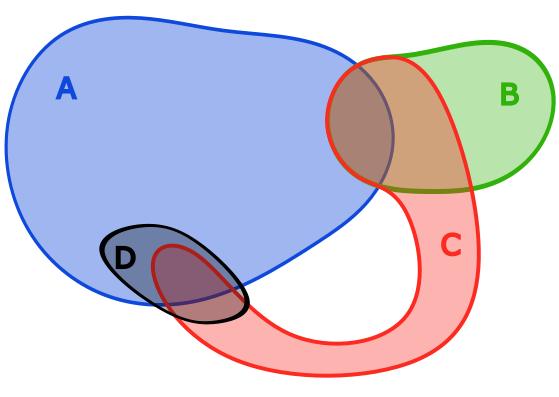

\newcommand{\indep}{\perp \!\! \perp}
\newcommand{\indic}{1\!\!1}

```{r setup, include=FALSE}
knitr::opts_chunk$set(echo = TRUE)
```


In this document, we want to define a new notion on conditional independence for a particular model and see if it corresponds to the "classic" extremal conditional independence. 

Let $V = \{1,\dots, d\}$.

# The latent linear model

## Presentation 

Let's consider a random vector $X$ of $\mathbb R^V$ (indexed by $V$) such that we have the following representation : 

$$
X = M Z +\varepsilon
$$
where $Z$ represents a unobservable random vector of $\mathbb R^K$ (identified as the latent variable), $M$ is a $d\times K$ matrix and $\varepsilon \in \mathbb R^d$ a random noise. 

For the next assumptions, we will use the same context as [@boulinVariableClusteringMultivariate2024], and so : 

- $K$ is not known and the dimensional parameters $d$ and $K$ can increase and be larger than $n$, the number of observation. 

- all the components of the random vector $Z$ are asymptotically independent with a tail indexx equal to one. It means that we can express the exponential measure as below : 

$$
\Lambda_Z = \sum_{k=1}^K \delta_0 \otimes \dots \otimes \Lambda_{Z_k} \otimes \dots \otimes \delta_0, \quad \quad \Lambda_{Z_k}(dy) = y^{-2}dy
$$

- the random noise $\varepsilon$ possess a distribution with a tail that is lighter than the factors (*what does it mean ?*).


## Induced properties

Theses assumptions give to the random vector $X$ the regular variation property and bring also a spectral measure $\Phi$ which have a discrete representation : 

$$
\Phi(.) =\sum_{k=1}^K ||M_{.k}|| \delta_{\frac{M_{.k}}{||M_{.k}||}}(.),
$$
with $\delta_x(.)$ the Dirac measure on $x$.

*I don't really see why all of this is true...*

Thus, we can compute the limit distribution for the maxima $n$ replications of $X$ : 

$$
\lim_{n \rightarrow \infty} \mathbb P(\bigvee_{j = 1}^n c_n^{-1}X_n < x) = \exp\Big[\sum_{k=1}^K \bigvee_{j = 1}^d \big(\frac{M_{kj}}{x_j}\big)\Big], \quad \quad x \in \mathbb R_+^d
$$
The maxima of vectors is defined as componentwise maxima. 

*I am sure this comes from the expression of the spectral measure $\Phi$ I need to understand that...*

# Conditionnal independance over $Z$ 

## Heuristic and definition

In the definition of our model, we can see that for each component $X_j$, or each subvector $X_A$, we can build a list containing all the components of $Z$ which define the latter component (or set of component).

For instance, if we define the model as below : 

$$
\begin{cases}
X_1 = Z_1 +2Z_4 + \varepsilon_1 \\
X_2 = 4Z_2 +Z_4 + \varepsilon_2 \\
X_3 = Z_2 - 3Z_3 + \varepsilon_3
\end{cases}
$$
One way to define a model of conditional independence is to look if the variable 

**TODO Heuristic**


Let $j \in V$ and $A \subset V$, let's define the index sets : 
$$
I_j = \{k \in [K] ~|~ m_{jk} \neq 0\} \quad \text{and} \quad I_A = \{k \in [K] ~|~\forall j \in A,~ m_{jk} \neq 0\}
$$

These sets represent the list of the component of $Z$ as presented above.

**Definition.** Let $A,B, C \subset V$. We say that $A$ and $B$ are conditionally independent over $Z$ according to $C$ if and only if : 
$$
I_A \cap I_B \subset I_C ~ (\Leftrightarrow (I_A \cap I_B) \setminus I_C = \emptyset)
$$
We will note $X_A \indep_Z X_B ~|~ X_C$.

In the case where $C = \emptyset$, then we note that $X_A \indep_Z X_B$ iif $I_A \cap I_B = \emptyset$.

## Properties

For this new notion of independence, we would like to verify if some general properties on the ternary relation. In particular, we would like to know if the model of independence is a **semi-graphoid**, or even a **graphoid**.

### Semi-graphoid case

So, we want to verify : 

- the **Symmetry** : $X_A \indep_Z X_B ~|~ X_C \Rightarrow X_B \indep_Z X_A ~|~ X_C$.

Indeed, if $I_A \cap I_B \subset I_C$ then $I_B \cap I_A \subset I_C$.

- the **Decomposition** : $X_A \indep_Z X_{B \cup D} ~|~ X_C \Rightarrow X_A \indep_Z X_B ~|~ X_C$.

We have $I_{B \cup D}= I_B \cup I_D$ and thus $I_A \cap I_B \subset (I_A\cap I_B) \cup (I_A \cap I_D) = I_A \cap I_{B \cup D} \subset I_C$.

- the **Weak Union** : $X_A \indep_Z X_{B \cup D} ~|~ X_C \Rightarrow X_A \indep_Z X_B ~|~ X_{C \cup D}$.

By decomposition we know already that $I_A \cap I_B \subset I_C$ and $I_{C \cup D}= I_C \cup I_D$. Therefore $I_A \cap I_B \subset I_C \subset I_{C \cup D}$.

- the **Contraction** : $X_A \indep_Z X_B ~|~ X_C \text{ and } X_A \indep_Z X_D ~|~ X_{B \cup C} \Rightarrow X_A \indep_Z X_{B \cup D} ~|~ X_C$.

We have $I_A \cap I_{B \cup D} = (I_A\cap I_B) \cup (I_A \cap I_D)$. First, we already have $I_A\cap I_B \subset I_C$ and $I_A\cap I_D \subset I_{B \cup C}$. These two relations induce that $I_A\cap I_D \subset I_C$ and thus $I_A \cap I_{B \cup D} \subset I_C$.


So our model of independence verify the four axioms of the semi-graphoid that is a very good point.


### Graphoid case

Now we want to know if the model is a graphoid, which means that the relation verify : 

**Intersection** : $X_A \indep_Z X_B ~|~ X_{C\cup D} \text{ and } X_A \indep_Z X_C ~|~ X_{B \cup D} \Rightarrow X_A \indep_Z X_{B \cup C} ~|~ X_D$.

Our model is strongly linked to set theory. Let's see the following figure :  

<center>
{width=50%}
</center>

We can verify visually that the intersection property is not true in this type of configuration. In our context, we can also build an example which is inspired of the configuration to show that our model of independence is not always a graphoid. 

$$
\begin{cases}
X_1 = Z_1 +2Z_2 - Z_3 + \varepsilon_1 \\
X_2 = 4Z_2 + -2Z_3 + Z_5 + \varepsilon_2 \\
X_3 = Z_2 - 3Z_3 + Z_4 + \varepsilon_3 \\
X_4 = 10Z_4 + \varepsilon_4 
\end{cases}
$$
In this example, we can build the index set for each component : 

$$
I_1 = \{1,2,3\},\quad I_2 = \{2,3,5\}, \quad I_3 = \{2,3,4\}, \quad I_4 = \{4\}
$$

One can verify that the intersection property is not true for this model.

## Extremal independance

Assume that $C= \emptyset$. We want to show that the independence over $Z$ is equivalent to the asymptotic independence for the corresponding Multivariate Generalized Pareto Distribution.

First, let's take a look to the exponential measure of $X$ using the expression from above : 

$$
\Lambda_X(\mathcal E \setminus [0,x]) = \sum_{k=1}^K \bigvee_{j = 1}^d \big(\frac{M_{kj}}{x_j}\big)
$$

We can see quickly that this expression is not derivable and the exponent measure does not have a density function over the Lebesgue measure.

Thus, the model of independence that we will consider here is the conditional independence over a Levy measure $\Lambda$ as defined in [@engelkeGraphicalModelsInfinite2024].

In particular, they show that there exist an equivalence between independence and the decomposition of the exponent measure. 

**Theorem.** Let $A, B$ a partition of $V$ and assume that the exponent measure follows the explosiveness assumption. Then the following statements are equivalent :  

- $A \indep B ~~[\Lambda]$.

- $\Lambda(y_A \neq 0 \text{ and } y_B \neq 0) = 0$.


Thus, we need to show two things : first that our spectral measure verifies the explosiveness assumption, and then, that we can show the second statement of above is true. 

### Explosiveness assumption

We can recall the explosiveness assumption before show that our model verify it. 

Let $\Lambda$ an exponential measure defined on $\mathbb R^V$. We say that the measure $\Lambda$ follows the explosiveness assumtpion if :
$$
\Lambda(y_v \neq 0) = \Lambda_{\{v\}}\Big((0, \infty)\Big) \in \{0, \infty\}, \quad \forall v \in V
$$

Fortunately, the one-dimensional marginal is easy to compute with a good choice of set : 
$$
\Lambda_{\{v\}}\Big((\frac1n, \infty)\Big) = n \sum_{k=1}^K m_{kj}.
$$
Thus if we consider the set $(0, \infty) = \bigcup_{i=1}^\infty (\frac1n, \infty)$, we can deduce by monotony of the measure that : 
$$
\Lambda(y_v \neq 0) = \lim_{n \rightarrow \infty}\Lambda_{\{v\}}\Big((\frac1n, \infty)\Big) = \lim_{n \rightarrow \infty}n \sum_{k=1}^K m_{kj} = \begin{cases}  0, \text{ if } \sum_{k=1}^K m_{kj} =0 \\ \infty, \text{ else } \end{cases}
$$

<div style="text-align:right;">$\square$</div>

### Same independence

Now, we can use the theorem from [@engelkeGraphicalModelsInfinite2024] to show that our new independence relation is the same as them. 

So, let's assume that $X_A \indep_Z X_B$. Then we have $I_A \cap I_B = \emptyset$. Then we can rewrite the expression of the exponent measure as :

$$
\Lambda(\mathcal E \setminus [0,x]) = \sum_{k \in I_A} \bigvee_{j \in A}^d \big(\frac{M_{kj}}{x_j}\big) + \sum_{k \in I_B} \bigvee_{j \in B}^d \big(\frac{M_{kj}}{x_j}\big) = \Lambda_A(\mathcal E_A \setminus [0,x_A]) + \Lambda_B(\mathcal E_B \setminus [0,x_B])
$$

However, we also have the general relation : 

\begin{align*}
\Lambda(\mathcal E \setminus [0,x]) &= 
\Lambda \Big[(\mathcal E_A \setminus [0,x_A])\times[0,x_B]^B\Big] + \Lambda\Big[[0,x_A]^A \times (\mathcal E_B \setminus [0,x_B])\Big]+ \Lambda \Big[(\mathcal E_A \setminus [0,x_A])\times(\mathcal E_B \setminus [0,x_B]) \Big] \\ 
&= \Lambda \Big[(\mathcal E_A \setminus [0,x_A])\times\mathcal E_B \Big] + \Lambda \Big[\mathcal E_A \times (\mathcal E_B \setminus [0,x_B])\Big] - \Lambda\Big[(\mathcal E_A \setminus [0,x_A])\times(\mathcal E_B \setminus [0,x_B])\Big] \\
& =\Lambda_A\Big[\mathcal E_A \setminus [0,x_A]\Big] + \Lambda_B\Big[\mathcal E_B \setminus [0,x_B]\Big] - \Lambda\Big[(\mathcal E_A \setminus [0,x_A])\times(\mathcal E_B \setminus [0,x_B])\Big]
\end{align*}


So, by using the alternative formula of the exponent measure, we can deduce that : 
$$
\Lambda\Big[(\mathcal E_A \setminus [0,x_A])\times(\mathcal E_B \setminus [0,x_B])\Big] =0, \quad \forall (x_A,x_B) \in \mathcal E_A \times \mathcal E_B
$$

Let's consider the family : 
$$
R_n = (\mathcal E_A \setminus [0,\frac1n])\times(\mathcal E_B \setminus [0,\frac1n])
$$
Of course, we have : 
$$
\bigcup_{n=1}^\infty R_n = \{y_A \neq 0 \text{ and } y_B \neq 0\}
$$
Thus, by monotony of the measure and the fact that $\Lambda(R_n) = 0$, for all $n \in \mathbb N^*$, we get : 

$$
\Lambda(y_A \neq 0 \text{ and } y_B \neq 0) = \lim_{n \rightarrow \infty} \Lambda(R_n) = 0
$$

<div style="text-align:right;">$\square$</div>

Everything seems to be good to continue and we would like to see if our new conditional independence relation fits well with the conditional independence over a measure.

## Extremal conditionnal independance

The goal of this section is to see if we have :
$$
X_A \indep_Z X_B ~|~ X_C \Longleftrightarrow A \indep B ~| ~C ~ [\Lambda]
$$


### References


